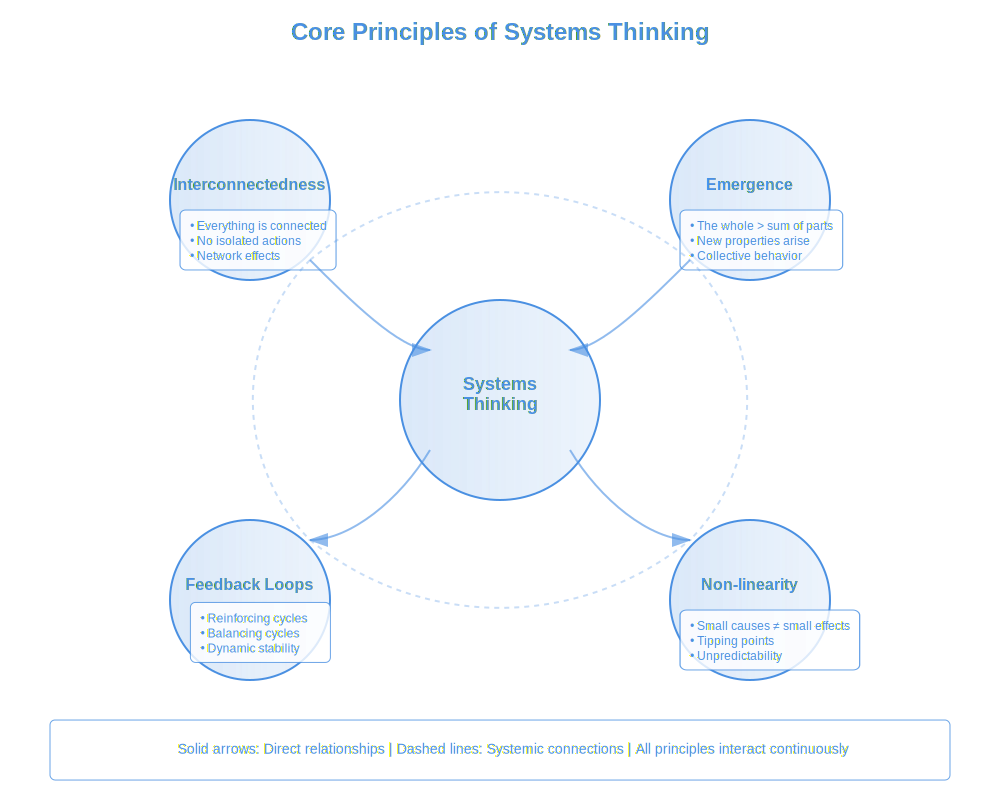
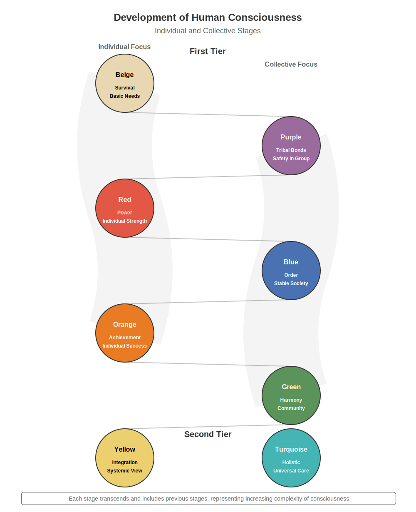

# ****Book:** Chapter 2: Understanding Global Complexity: Systems Thinking & Development Models**
*(From "Globalize: Natural Steps Toward a Thriving World Governance")*

Building an ethical global governance system requires us to understand how complex systems work—from individual human development to civilizational evolution. This chapter explores two powerful frameworks that can guide our approach:

- **Systems Thinking:** Understanding how parts interconnect and influence each other
- **Spiral Dynamics:** A model of how human consciousness and societies evolve
- **Practical Applications:** How these frameworks inform ethical global governance

---

## **1. Why We Need Systems Thinking for Global Governance**

- **The Problem:**
- Traditional governance models often use **linear, reductionist thinking**—trying to solve complex problems by breaking them into parts.
- This approach **fails to account for interconnections**, leading to unintended consequences and failed solutions.
- Global challenges like climate change, inequality, and technological disruption are **systemic problems that require systemic solutions**.

- **The Solution: Systems Thinking as a Foundation for Global Governance**

**Figure 2.1: Core Principles of Systems Thinking**

Systems thinking provides a framework for understanding complex global challenges. As illustrated in the diagram, four fundamental principles work together to shape our understanding of systems:

**Interconnectedness**
Everything in a system is connected, directly or indirectly. No action occurs in isolation:
- Changes in one area ripple throughout the system
- Local actions can have global consequences
- Relationships often matter more than individual components

**Emergence**
Systems exhibit properties that arise from the interaction of their parts:
- The whole becomes greater than the sum of its parts
- New behaviors and patterns emerge at different scales
- Collective properties cannot be predicted from individual elements alone

**Feedback Loops**
Systems maintain themselves through continuous cycles of feedback:
- Reinforcing loops amplify changes (like compound interest)
- Balancing loops maintain stability (like body temperature)
- Multiple feedback loops create dynamic equilibrium

**Non-linearity**
Relationships in systems are rarely proportional:
- Small changes can have large effects
- Systems can reach tipping points and shift suddenly
- Cause and effect are often separated in time and space

These principles interact continuously (shown by dashed lines), creating the complex dynamics we see in global systems. Understanding these interactions is crucial for effective global governance, as they show why simple, linear solutions often fail to address complex challenges.

### **Key Principles of Systems Thinking**

- **Interconnectedness:**
- Every part of a system affects and is affected by other parts
- Changes in one area create ripple effects throughout the system
- Solutions must consider both direct and indirect impacts

**Example:** A policy to reduce carbon emissions in one country might lead to increased emissions elsewhere if we don't consider global economic interconnections.

- **Emergence:**
- Complex systems exhibit behaviors that emerge from interactions between parts
- These emergent properties cannot be predicted by looking at parts in isolation
- Global governance must work with, not against, emergent patterns

**Example:** The internet wasn't designed by any single authority but emerged from countless interactions, creating a self-organizing global network.

- **Feedback Loops:**
- Systems contain reinforcing loops (amplifying changes) and balancing loops (maintaining stability)
- Understanding these loops helps us design better interventions
- Governance must identify and work with natural feedback mechanisms

**Example:** Social media can create reinforcing loops of political polarization, but also balancing loops of collective problem-solving.

---

## **2. Spiral Dynamics: Understanding Human Development & Social Evolution**

- **The Challenge:**
- Global governance must work with different levels of social development
- Solutions that work in one context may fail in another
- We need a framework for understanding how societies evolve

- **The Solution: Spiral Dynamics as a Map of Human Development**

### **The Spiral Model of Development**

Each level represents a way of thinking about and organizing society:

- **Survival (Beige):**
- Focus on immediate survival needs
- Relevant to crisis response and basic aid
- Global governance must ensure universal access to basic necessities

- **Tribal (Purple):**
- Emphasis on tradition, kinship, and group bonds
- Important for cultural preservation and local governance
- Global systems must respect and work with traditional structures

- **Power (Red):**
- Dominance, strength, and immediate gratification
- Present in geopolitical competition and corporate power
- Global governance must transform power dynamics toward cooperation

- **Order (Blue):**
- Rules, structure, and absolute truth
- Seen in bureaucracies and traditional institutions
- Important for establishing stable governance frameworks

- **Achievement (Orange):**
- Innovation, progress, and individual success
- Drives technological and economic development
- Must be balanced with sustainability and collective well-being

- **Community (Green):**
- Equality, harmony, and shared resources
- Essential for environmental protection and social justice
- Foundation for participatory global governance

- **Systemic (Yellow):**
- Integration, flexibility, and natural flows
- Key to designing adaptive governance systems
- Enables cooperation across different development levels

- **Holistic (Turquoise):**
- Global consciousness and planetary awareness
- Ultimate aim of ethical global governance
- Synergy between individual and collective thriving

---

## **3. Practical Applications for Global Governance**

### ** Designing Adaptive Governance Systems**

- **Multi-Level Solutions:**
- Governance must operate at multiple levels simultaneously
- Local solutions tailored to development levels
- Global frameworks that accommodate diversity

- **Natural Hierarchies:**
- Understanding how different governance levels nest within each other
- Creating systems that balance autonomy and integration
- Using AI to coordinate across levels while preserving local agency

- **Development-Aware Policies:**
- Policies adapted to different developmental stages
- Pathways for evolution toward more complex governance
- Support for natural development without forcing change

### **Examples in Practice**

- **Economic Systems:**
- Different economic models for different development levels
- Gradual evolution toward more sophisticated systems
- Integration through adaptive frameworks like AUBI

- **Conflict Resolution:**
- Understanding conflicts through developmental lens
- Solutions that work with natural evolution
- Prevention through systemic understanding

- **Environmental Protection:**
- Systems approach to ecological challenges
- Integration of different worldviews
- Solutions that work with natural processes

---

For readers interested in exploring these systems concepts more deeply, additional perspectives on intelligence as a fundamental aspect of reality and its implications for governance can be found in 'Understanding Infinite Intelligence: A Systems Perspective' (Holmström, 2024). While more philosophical in nature, these ideas offer fascinating context for understanding how complex systems might self-organize at global scales.

---

## **Conclusion: A Development-Aware Approach to Global Governance**

For global governance to succeed, it must:
- **Use systems thinking to understand complex challenges**
- **Work with different levels of development**
- **Create conditions for natural evolution toward higher complexity**
- **Design adaptive systems that accommodate diversity**

 **By understanding systems and development, we can create governance that works with nature rather than against it.**

 **Next, we explore the foundations of ethical global governance—how to build systems that respect both unity and diversity.**
