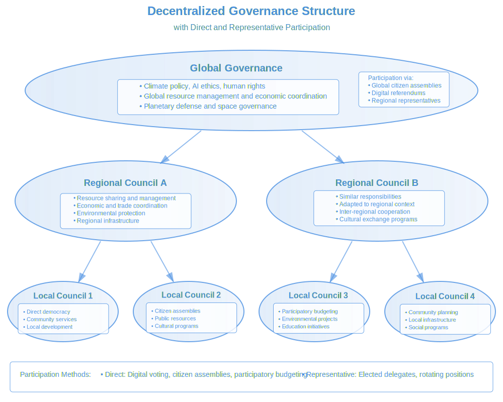

# ****Book:** Chapter 3: The Foundations of Ethical Global Governance**
*(From "Globalize: Natural Steps Toward a Thriving World Governance")*

## **1. Key Principles of Ethical Global Governance**

A **just and effective global governance system** must be built on a **foundation of principles** that ensure fairness, participation, and adaptability. These principles **prevent authoritarianism, protect freedoms, and ensure long-term sustainability**.

### **Decentralization: Power Must Be Distributed, Not Concentrated**
- **The Problem:** Traditional global governance models (e.g., the UN, IMF, WTO) tend to centralize power in **elite institutions**, making decisions **without direct participation from the people**.

- **The Solution:** **Decentralized governance** ensures **power is distributed across multiple levels** (local, regional, global) so that:
- **Communities govern themselves while contributing to a larger whole.**
- **No single nation, corporation, or governing body dominates decision-making.**
- **Decisions are made at the lowest effective level (subsidiarity principle).**

**Example:** A **global climate council** might set broad targets, but **local regions decide how to implement sustainability practices in their own way**.

**Figure 3.1: Decentralized Governance Structure**

The diagram above illustrates how a decentralized governance system distributes power across multiple levels while maintaining coordination. Each level has distinct responsibilities suited to its scope:

- **Global Level:** Handles planetary-scale challenges like climate change, AI ethics, and human rights. Participation occurs through both global citizen assemblies and regional representatives, ensuring both direct citizen input and coordinated action.

- **Regional Level:** Manages resource sharing, economic coordination, and cross-border cooperation between communities. These councils bridge local needs with global initiatives, adapting broader policies to regional contexts.

- **Local Level:** Focuses on direct community governance through citizen assemblies, participatory budgeting, and local development. This is where most day-to-day decisions affecting communities are made, following the principle of subsidiarity.

Importantly, influence flows both up and down through the system. While higher levels coordinate broader issues, they remain accountable to and informed by local input. This ensures that global policies reflect ground-level realities while maintaining the efficiency needed for planetary-scale challenges.

---

### **Transparency: Governance Must Be Visible & Accountable**
- **The Problem:** Current global institutions **lack transparency**—policy decisions are often made **behind closed doors**, leading to **corruption, distrust, and elite control**.

- **The Solution:** **Radical transparency** through:
- **Publicly accessible decision-making records (blockchain governance).**
- **AI-assisted tracking of political funding & lobbying.**
- **Citizen oversight mechanisms for real-time accountability.**

**Example:** Every global governance decision could be **recorded in a publicly auditable ledger**, ensuring that **all policies and resource allocations are transparent**.

---

### **Participation: A System That Listens to Everyone, Not Just the Powerful**
- **The Problem:** Current governance models prioritize **wealthy nations, political elites, and corporate interests**, sidelining **ordinary citizens, Indigenous voices, and marginalized communities**.

- **The Solution:** **Participatory democracy**, where:
- **Every individual has a voice in global decision-making.**
- **Citizens can propose, vote on, and veto policies (direct & liquid democracy).**
- **Global governance adapts to the needs of local populations.**

**Example:** Instead of **politicians deciding on global environmental policies**, **a decentralized citizen voting system** could allow people worldwide to **weigh in on major global issues**.

---

### **Human Rights: A Global Constitution Protecting Individual & Collective Freedoms**
- **The Problem:** Human rights protections **vary across nations**—some countries **violate basic freedoms**, and global institutions **lack enforcement mechanisms**.

- **The Solution:** A **Global Rights Charter** that:
- **Ensures freedom of speech, privacy, and autonomy.**
- **Protects mental sovereignty (no forced AI/BCI influence).**
- **Guarantees economic fairness (AUBI, access to resources, anti-monopoly measures).**

**Example:** No government, corporation, or AI system should **violate an individual's autonomy**, whether it’s **freedom of expression, mental privacy, or access to basic needs**.

---

## **2. Learning from Successful Governance Models**

Instead of building a **global government from scratch**, we can learn from **existing governance models**—taking **what works** and **avoiding past mistakes**.

### **The European Union (EU): Lessons in Regional Cooperation**
- **Successes:**
- **Cooperative economic policies (Eurozone, trade agreements).**
- **Freedom of movement across borders.**
- **Cross-national climate and human rights initiatives.**

- **Challenges:**
- **Bureaucracy & inefficiency in decision-making.**
- **Democratic deficits (citizens often feel disconnected from policy decisions).**

- **Lesson:** A **global governance model** should ensure **decentralization and direct citizen engagement**, avoiding **top-heavy bureaucracy**.

---

### **The United Nations (UN): A Global Forum With Structural Limitations**
- **Successes:**
- **International cooperation in conflict resolution.**
- **Humanitarian aid and global development programs.**
- **Frameworks for global treaties (climate, trade, human rights).**

- **Challenges:**
- **No real enforcement power (e.g., human rights violations often go unpunished).**
- **Security Council veto power gives undue influence to a few nations.**

- **Lesson:** Future global governance must be **truly democratic**, with **no single nation having excessive power over decision-making**.

---

### **Indigenous & Holarchic Governance: Nature-Aligned Decision-Making**
- **Successes:**
- **Decentralized power structures ensure that decisions happen at the most relevant level.**
- **Ecosystem-based governance (land and resources are managed with sustainability in mind).**
- **Consensus-driven decision-making avoids authoritarian control.**

- **Challenges:**
- **Scaling traditional governance methods to a global system requires technological support.**

- **Lesson:** A **global model must incorporate decentralized, eco-centric, and consensus-based governance**, avoiding **purely hierarchical structures**.

---

### **Liquid Democracy: A Blend of Direct & Representative Democracy**
- **Successes:**
- **Citizens vote directly on issues or delegate their vote to trusted representatives.**
- **Ensures expertise-driven decisions without removing individual agency.**

- **Challenges:**
- **Still in early experimental stages.**

- **Lesson:** Liquid democracy could be **tested in global decision-making**, ensuring **people directly shape policies while experts refine implementation**.

---

## **3. The Role of AI & Technology in Decision-Making**

### **AI as an Advisor, Not a Ruler**
- **The Problem:**
- AI can **process vast amounts of information**, but relying on **fully AI-driven governance** risks **bias, manipulation, and loss of human agency**.

- **The Solution:**
- **AI should assist, not replace, human decision-making.**
- AI-driven **policy simulations can predict consequences before implementation**.
- AI-assisted **citizen voting & real-time feedback mechanisms ensure dynamic governance.**

---

### **Blockchain for Radical Transparency**
- **Prevents corruption & ensures public trust.**
- **Records every decision, policy change, and fund allocation.**
- **Allows real-time verification of governance integrity.**

**Example:** A **global voting system** could run on a **publicly auditable blockchain**, making governance **fully transparent**.

---

### **Digital Governance Platforms for Citizen Participation**
- **Decentralized, AI-assisted voting systems allow citizens worldwide to shape policy.**
- **Smart contracts ensure policy commitments are honored.**
- **Multi-language, accessible platforms ensure inclusivity.**

**Example:** An AI-powered **citizen deliberation platform** could allow individuals **to engage in global debates, submit policy ideas, and vote on key initiatives**.

---

## **Conclusion: The Foundation for a Thriving World Government**
A **just global governance model** must:
- **Be decentralized, ensuring no central authority dominates decision-making.**
- **Guarantee transparency through blockchain and AI oversight.**
- **Prioritize human rights and participatory democracy.**
- **Integrate AI to assist decision-making, not control it.**
- **Incorporate the best aspects of existing governance models while avoiding their pitfalls.**

 **The next chapter will explore the first steps in transitioning toward global governance—starting with strengthening international institutions, citizen engagement, and economic transformation.**

