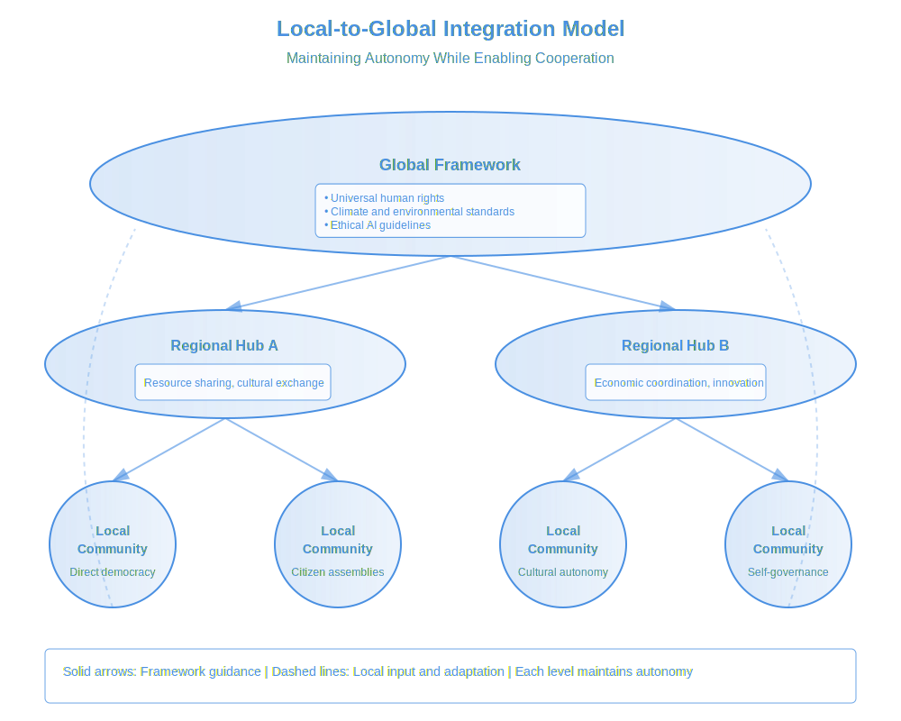

# ****Book:** Chapter 5: Step 2 – Local-to-Global Integration**
*(From "Globalize: Natural Steps Toward a Thriving World Governance")*

For global governance to be **legitimate and sustainable**, it must be **deeply decentralized** while ensuring **effective global coordination**. The challenge is to **prevent authoritarian overreach**, protect **local and cultural autonomy**, and transition **military structures toward peacekeeping and conflict prevention**.

This chapter explores how to:
- Establish **decentralized power structures** to prevent authoritarianism.
- Protect **cultural and national autonomy** while ensuring global cooperation.
- Transition military spending toward **global peacekeeping and AI-assisted conflict prevention**.

**Figure 5.1: Local-to-Global Integration Model**

This model illustrates how different levels of governance can work together while preserving local autonomy. The system operates through three interconnected layers:

**Global Framework**
Provides universal guidelines and standards that ensure:
- Basic human rights and freedoms
- Environmental protection standards
- Ethical guidelines for technology
This framework sets boundaries without dictating specific implementations.

**Regional Hubs**
Act as bridges between global and local levels by:
- Facilitating resource sharing between communities
- Coordinating economic activities
- Supporting cultural exchange
- Enabling inter-community cooperation
Each hub adapts global frameworks to regional contexts while respecting local autonomy.

**Local Communities**
Maintain direct democratic control over:
- Day-to-day governance
- Cultural practices
- Resource management
- Community development
Communities can implement global standards in ways that suit their unique contexts.

The dashed lines show how local input flows back up through the system, ensuring that global frameworks remain responsive to ground-level realities. This creates a dynamic balance between unity and diversity, allowing communities to benefit from global cooperation while preserving their unique character.

---

## **1. Decentralized Power Structures to Prevent Authoritarianism**

- **The Problem:**
- Traditional global governance models (e.g., UN, WTO, IMF) **centralize decision-making** in elite institutions, creating **top-heavy bureaucracies**.
- Centralized global power could be **hijacked by corporate or authoritarian interests**.
- **People fear global governance could lead to a dystopian "One World Order."**

- **The Solution: A Holarchic Governance Model**
A **holarchic system** ensures that **governance is layered and distributed**, avoiding both **authoritarianism and fragmentation**.

### **How It Works:**
- **Local First:** Power starts **at the community level**—decisions affecting local life are made locally.
- **Regional Councils:** Localities **elect representatives to regional councils**, ensuring **broader cooperation without central control**.
- **Global Coordination Centers:** Global issues (e.g., climate, AI, human rights) are handled by **specialized councils with citizen oversight**.
- **Direct & Liquid Democracy:** Citizens can vote directly on global issues **or delegate their votes** to trusted experts.

**Example:** A **global environmental policy** would be **set collaboratively**, but local communities **decide how to meet sustainability targets based on their own needs**.

---

### **Decentralization in Action:**
- **Blockchain for Transparency:** Global policies and funding are **tracked in real-time using decentralized ledgers**.
- **AI-Assisted Governance:** AI can **generate multiple governance models**, allowing people to **choose the best policies via direct participation**.
- **Citizen Assemblies Hold Global Officials Accountable:** No global decision should be made **without citizen oversight and veto power**.

 **Outcome:** A governance system that is **bottom-up, transparent, and resistant to elite capture**.

---

## **2. Protecting Cultural Autonomy While Enabling Global Cooperation**

- **The Problem:**
- People fear that a global governance system would **erase cultural identities**, imposing **a singular global culture**.
- Current international institutions **often ignore Indigenous knowledge and non-Western perspectives**.
- Nationalism, if unchecked, can **become a barrier to global cooperation**.

- **The Solution: Cultural Sovereignty Within a Global Ethical Framework**
Cultural autonomy **must be actively protected**, while ensuring **universal human rights and ecological sustainability**.

### **Key Principles of Cultural Protection:**
- **No Forced Cultural Assimilation:** Local cultures retain **full autonomy** over traditions, languages, and social practices.
- **Global Governance as a Framework, Not an Enforcer:** The system provides **ethical guidelines but allows communities to self-govern**.
- **Intercultural Exchange Without Domination:** Encourage **mutual learning between cultures** without imposing **one worldview over another**.

**Example:** A **global education system** could integrate **multiple historical perspectives**, rather than pushing a **single dominant narrative**.

---

### **Practical Implementation:**
- **Global Charter of Cultural Rights:** A binding **agreement that guarantees cultural autonomy**, preventing **forced assimilation or ideological hegemony**.
- **Localized Decision-Making on Ethical Grounds:** Communities **self-govern within a universal human rights framework**—protecting both **cultural diversity and individual freedoms**.
- **AI-Powered Language & Knowledge Preservation:** AI tools can be used to **preserve endangered languages and document Indigenous wisdom**, ensuring that **globalization does not erase traditions**.

 **Outcome:** A world where **cultural identities are preserved, respected, and enriched**, while **global cooperation strengthens planetary well-being**.

---

## **3. Transitioning Military Spending Toward Global Peacekeeping & AI-Based Conflict Prevention**

- **The Problem:**
- **Military budgets are unsustainable**—global military spending exceeds **$2 trillion annually**, while essential services **remain underfunded**.
- Wars continue to be fought for **resources, nationalism, and geopolitical dominance**, despite **interconnected global economies**.
- National militaries often **lack accountability** and **fuel conflicts rather than preventing them**.

- **The Solution: Phased Demilitarization & AI-Assisted Conflict Prevention**
A **gradual transition from national militaries to global peacekeeping forces** would ensure **security without war**.

### **The Roadmap to Global Peacekeeping:**
- **Phase 1: Military Transparency & AI Accountability**
- All nations **must report military spending and troop movements in real-time** (via blockchain tracking).
- **AI-driven conflict prediction** can analyze data to **detect early signs of war**, allowing for **diplomatic intervention before escalation**.

- **Phase 2: Cooperative Global Defense & Peacekeeping**
- Establish a **Global Peacekeeping Force** that responds to conflicts **without nationalistic bias**.
- AI-assisted **crisis diplomacy tools** allow for **automated de-escalation strategies**.

- **Phase 3: Economic Shift from War to Well-Being**
- Military budgets are **gradually redirected to global infrastructure, health, and sustainability initiatives**.
- Create **"Peace Dividends"**—economic incentives for nations **that disarm and reinvest in their societies**.

**Example:** If an **AI conflict-prediction model detects tensions rising in a region**, a **peacekeeping task force could intervene diplomatically** before violence erupts.

---

### **Practical Implementation:**
- **AI-Assisted War Prevention:** AI can **model peaceful alternatives** and **generate conflict-resolution strategies in real-time**.
- **Global Disarmament Treaties with Citizen Oversight:** Any military action **must be approved by citizen votes**, ensuring **transparency and ethical warfare prevention**.
- **Cybersecurity & Digital Peacekeeping:** A new **"Cyber UN"** could **neutralize cyber threats** before they escalate into digital warfare.

 **Outcome:** A future where **resources are spent on human flourishing rather than destruction**—where technology **protects people rather than fueling conflicts**.

---

### **Rethinking Weapons: From Destruction to Harmless Intervention**
- **The Problem:**
- Traditional weapons systems **rely on destruction, fear, and casualties** to achieve strategic goals.
- Even so-called **"precision strikes"** often lead to **civilian casualties, infrastructure destruction, and long-term instability**.
- The current military-industrial complex **profits from destruction rather than peacekeeping**.

- **The Solution: Non-Lethal, Non-Destructive Intervention Technologies**
A **new paradigm for conflict resolution** should focus on **incapacitation, disruption, and de-escalation** rather than death and destruction.

---

### **Key Strategies for Non-Lethal Intervention:**
- **Neural Disruptors & Electromagnetic Incapacitation**
- **AI-assisted neural disruption tech** could temporarily disable hostile actors **without harming their long-term health or cognition**.
- **Electromagnetic pulse (EMP) technology** can **neutralize weapons, vehicles, and cyberattacks** without casualties.

- **AI-Powered Psychological & Cyber Intervention**
- **AI-driven de-escalation models** can analyze conflicts and suggest **diplomatic, social, and psychological interventions** before violence erupts.
- **Cyber-intervention tools** can **disable rogue military infrastructure, redirect missile systems, or neutralize threats digitally** rather than physically.

- **Autonomous Non-Lethal Drone Peacekeeping**
- **Drones equipped with advanced incapacitation technology** (sonic disruptors, electromagnetic waves, rapid-deploy barriers) can **halt violence without killing**.
- AI **predicts escalation points** and dispatches **non-lethal intervention units** before violence spreads.

- **Global Surveillance Without Oppression**
- AI-driven **predictive models can anticipate violent outbreaks**, allowing for **early intervention through diplomacy, resource allocation, and conflict resolution strategies**.
- All surveillance **must be transparent and citizen-audited** to **prevent authoritarian misuse**.

**Example:** If **a violent riot escalates**, AI-coordinated drones could **deploy non-lethal sound waves or immobilizing foam** to stop aggression without **injuries or fatalities**.

---

### **The Ethical Principles of Harmless Defense:**
- **Intervention should never cause long-term harm** (physical, mental, or economic).
- **Weapons should be designed to neutralize conflict, not escalate it.**
- **AI should prevent war before it starts, not optimize battlefield efficiency.**
- **Global peacekeeping forces must be accountable to citizen oversight.**

 **Outcome:** A world where **military spending is redirected toward peace-enhancing technologies**, ensuring **conflicts are resolved without bloodshed, destruction, or human suffering**.

---

## **Conclusion: The Path to Local-to-Global Integration**
For **global governance to be ethical and effective**, it must:
- **Be decentralized**—avoiding authoritarian control.
- **Respect cultural autonomy** while ensuring universal rights.
- **Transition from militarization to peacekeeping and AI-driven conflict prevention**.

 **This chapter lays the groundwork for a balanced, participatory, and just global system.**

 **Next, we explore Step 3: Ethical AI & Digital Governance—how AI can be used to strengthen transparency, decision-making, and economic equity without violating human rights.**

