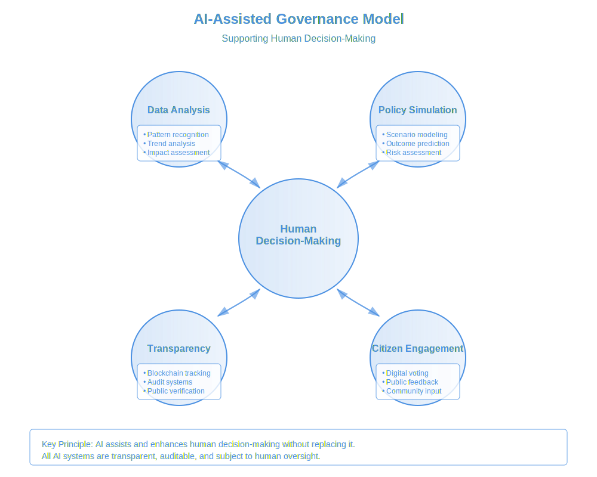

# ****Book:** Chapter 6: Step 3 – Ethical AI & Digital Governance**
*(From "Globalize: Natural Steps Toward a Thriving World Governance")*

As **AI and digital technologies become central to governance**, we must ensure they **enhance democracy rather than replace it, safeguard human autonomy rather than erode it, and remain accountable to the people rather than concentrated in elite hands**.

This chapter explores:
- **AI-assisted policy-making and direct democracy** to increase efficiency and participation.
- **Preventing AI & Brain-Computer Interface (BCI) abuse** to protect autonomy.
- **Ensuring the right to mental sovereignty and unmodified thought** in a digitized world.

---

## **1. AI-Assisted Policy-Making & Direct Democracy**

- **The Problem:**
- **Current governance models are slow and inefficient**, failing to process large-scale information in real time.
- **Bureaucracy and political stagnation** prevent swift action on urgent issues.
- **People feel disconnected from governance**, as decisions are often made by **unaccountable elites**.

- **The Solution: AI-Augmented Direct Democracy**
By integrating AI **into governance as a tool, not a ruler**, we can **streamline decision-making while ensuring broad participation**.

**Figure 6.1: AI-Assisted Governance Model**

This diagram illustrates how AI can enhance governance while maintaining human decision-making at its core. The model consists of four key support systems, all centered around and serving human decision-making processes:

1. **Data Analysis**
AI systems process vast amounts of information, identifying patterns and trends that inform policy options. This augments human understanding without replacing human judgment.

2. **Policy Simulation**
Before decisions are made, AI can model potential outcomes of different policy choices, allowing citizens and leaders to make more informed decisions based on comprehensive scenario analysis.

3. **Transparency**
Blockchain and AI audit systems ensure all governance processes remain visible and verifiable, preventing manipulation and building public trust.

4. **Citizen Engagement**
Digital platforms, supported by AI, enable direct participation in decision-making while ensuring accessibility and preventing manipulation.

Importantly, all these systems operate in continuous dialogue with human decision-makers, as shown by the bidirectional arrows. This ensures AI remains a tool for enhancing human governance rather than replacing it. Each component is designed to be transparent and subject to public oversight, preventing the concentration of power in either technological systems or elite groups.

---

### **AI in Governance: The Right Role**
AI should function as a **policy advisor**, not a **decision-maker**, providing:
- **Real-time data analysis** to predict policy outcomes.
- **Multiple policy simulations**, allowing citizens to compare different options.
- **Bias detection** to ensure governance remains fair and just.

**Example:** Instead of **politicians crafting economic policy behind closed doors**, AI could **generate multiple economic models**, allowing citizens to vote on **the most ethical and effective option**.

Some theorists suggest that intelligence might be better understood as a permeating aspect of reality rather than something confined to individual entities. While such perspectives are more philosophical than practical, they raise interesting questions about how AI might participate in rather than dominate governance systems.

---

### **Direct Democracy Enhanced by AI**
- **Liquid Democracy:** People vote directly on policies or **delegate their vote** to trusted experts.
- **AI Policy Simulation:** AI presents **consequences of different policies** before they are enacted.
- **Blockchain Voting Transparency:** Ensures **all votes and decisions are traceable, tamper-proof, and verifiable**.

**Example:** If a **global climate policy** is being considered, AI could **simulate the impact of different approaches**, presenting clear trade-offs **before people vote**.

 **Outcome:** A **participatory democracy** where decisions are **informed, decentralized, and accountable to the people**.

---

## **2. Preventing AI & Brain-Computer Interface (BCI) Abuse**

- **The Problem:**
- AI & BCIs can **erode privacy, manipulate thoughts, or even control human behavior** if left unregulated.
- **Governments and corporations** already use AI for **mass surveillance, behavior prediction, and neurological research**.
- BCIs could **blur the boundary between personal autonomy and external influence**.

- **The Solution: Strict Global Safeguards on AI & BCI Use**

---

### **The Dangers of Unregulated AI & BCIs**
- **AI Manipulation of Public Perception** – AI-driven media could **generate bias, misinformation, or ideological enforcement**.
- **BCI Thought Invasion** – BCIs could **read or modify thoughts**, threatening cognitive freedom.
- **AI Corporate & Government Control** – A centralized AI-driven governance system could **lead to authoritarianism**.

- **The Ethical AI & BCI Protection Framework:**
- **AI Transparency & Open Source Audits** – All governance-related AI must be **publicly audited and open-source** to prevent hidden manipulation.
- **Decentralized AI Control** – AI should be governed by **global citizen councils**, preventing **corporate or national dominance**.
- **Strict BCI Safeguards** – No government or corporation should have **the ability to read, alter, or influence thoughts** through BCIs.
- **Personal AI Assistants vs. Centralized AI Rule** – AI should be **a personal augmentation tool** rather than a **central authority over society**.

**Example:** If a **government AI suggests social policies**, it must show **exactly how it arrived at its conclusions**, and people **must have the ability to override it**.

 **Outcome:** A world where **AI and BCIs serve humanity, rather than control it**.

---

## **3. The Right to Mental Sovereignty & Unmodified Thought**

- **The Problem:**
- **Mind control is no longer science fiction**—governments and corporations already explore **brainwave monitoring, neuro-marketing, and cognitive behavioral prediction**.
- **AI-generated subliminal influence** could shape elections, consumer behavior, and ideological trends **without people realizing it**.
- **BCIs could enable direct modification of emotions, memories, or behaviors**, raising ethical concerns.

- **The Solution: A New Human Right – The Right to Mental Sovereignty**

---

### **Mental Sovereignty Principles**
- **No Forced BCI Use:** No one should be **required** to integrate with BCIs for work, education, or governance.
- **Right to Cognitive Privacy:** Thoughts should be **as legally protected as physical property**—no AI or BCI should **read, modify, or extract information from a brain without explicit consent**.
- **No AI-Driven Behavioral Manipulation:** AI must never be used to **alter human decision-making or free will**.
- **Ethical Neuro-AI Research Governance:** All neurotechnology should be **monitored by a decentralized, citizen-led ethics board**.

**Example:** A **corporation developing BCIs** must undergo **public ethical review**, ensuring **its technology cannot be used for thought control**.

 **Outcome:** A future where **human minds remain free, unaltered, and sovereign**—no one is **forced into AI integration or neural control**.

---

## **Conclusion: The Ethical AI & Digital Governance Roadmap**
For AI & digital governance to serve humanity rather than control it, we must:
- **Ensure AI remains a policy tool, not a ruler.**
- **Use AI to enhance direct democracy, not replace human decision-making.**
- **Prevent AI & BCI abuse through strict oversight and decentralized control.**
- **Guarantee mental sovereignty as a fundamental human right.**

 **This chapter lays the foundation for an ethical, transparent, and participatory digital governance model.**

 **Next, we explore Step 4: Fair Economic & Resource Distribution—how to transition toward an equitable global economic system without reinforcing exploitation or monopolization.**

