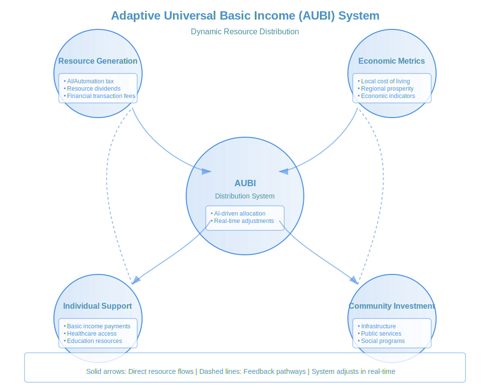

# ****Book:** Chapter 7: Step 4 – Fair Economic & Resource Distribution**
*(From "Globalize: Natural Steps Toward a Thriving World Governance")*

For global governance to be **fair and sustainable**, it must address **economic inequality and resource distribution**. A **thriving civilization requires economic models that uplift all people, rather than concentrating wealth and resources in the hands of a few**.

This chapter explores:
- **Transitioning from exploitative economic systems to ethical global wealth distribution.**
- **Ensuring fair access to resources through decentralized economic policies.**
- **Preventing corporate monopolization and wealth concentration.**

---

## **1. The Problem: Wealth & Resource Inequality**

- **The Current System Fails Because:**
- **1% of the world's population controls nearly half of global wealth**, creating extreme inequality.
- **Essential resources (water, food, energy) are treated as commodities** rather than human rights.
- **AI & automation are increasing productivity but consolidating wealth** instead of distributing it.
- **Developing nations remain trapped in debt cycles**, preventing global economic fairness.

- **The Solution: A Transition to Fair, Decentralized Wealth & Resource Management**

---

### **Creating a Global Economic Equity Framework**
- **A New Wealth Metric:** Move away from **GDP-focused economies** to a system that measures **human well-being, sustainability, and equitable access to resources**.
- **Progressive Global Taxation:** Implement **micro-taxes on AI-driven profits, financial transactions, and speculative wealth** to fund public goods.
- **Eliminate Resource Monopolization:** No individual or corporation should be allowed to **own excessive amounts of essential resources (land, water, energy).**

**Example:** Instead of billionaires **hoarding trillions in private accounts**, a fraction of global wealth could be **redirected to fund healthcare, education, and sustainable development.**

 **Outcome:** An economy that **ensures no one is left behind** while **still encouraging innovation and personal prosperity.**

---

## **2. Ensuring Fair Access to Resources Through Decentralization**

- **The Problem:**
- **Resources are concentrated in a few hands**, leading to artificial scarcity.
- **Nations compete for resources rather than sharing them.**
- **Environmental destruction accelerates as corporations prioritize profit over sustainability.**

- **The Solution: A Decentralized Resource Allocation Model**

---

### **Ethical Resource Distribution Principles**
- **Commons-Based Management:** Essential resources (water, food, energy) must be treated as **public goods, not corporate assets.**
- **Decentralized Resource Networks:** Utilize **blockchain and AI-driven monitoring systems** to track and **fairly allocate** resources where they are needed.
- **Global Cooperative Ownership Models:** Industries essential to survival (agriculture, healthcare, energy) should be **cooperatively owned rather than privatized**.

**Example:** A **global digital ledger** could track **real-time food and water availability**, ensuring **fair distribution to areas experiencing shortages.**

 **Outcome:** A world where **basic needs are guaranteed, and environmental sustainability is prioritized** over corporate profit.

---

## **3. Preventing Corporate Monopolization & Wealth Hoarding**

- **The Problem:**
- **Multinational corporations control vast sectors of the economy**, wielding more power than many governments.
- **AI-driven capitalism is creating monopolies**, where a few companies control vast amounts of **data, automation, and wealth.**
- **Governments are often powerless against corporate interests**, leading to policies that **serve profit rather than people**.

- **The Solution: Economic Decentralization & Cooperative Ownership**

---

### **Restructuring the Economic System for Fairness**
- **Break Up Monopolies:** Implement **global antitrust laws** to prevent corporate overreach.
- **Cooperative Economic Models:** Transition industries from **corporate ownership to cooperative, citizen-owned models.**
- **AI-Driven Economic Regulation:** Use AI to **analyze and prevent exploitative financial practices** in real-time.

**Example:** Instead of **AI being used to optimize corporate profits**, **it could be used to regulate global markets and prevent financial speculation that harms workers.**

 **Outcome:** A world where **economic power is decentralized, ensuring wealth and opportunities are shared fairly.**

---

## **4. Implementing Adaptive Universal Basic Income (AUBI)**
- **The Problem:**
- **Automation and AI are rapidly replacing jobs**, but wealth is **not being redistributed to those displaced**.
- **Economic insecurity** forces people into **survival mode**, limiting their ability to contribute to society.
- Traditional **UBI models** are often criticized for being **static**, treating all economies the same.

- **The Solution: Adaptive Universal Basic Income (AUBI)**
AUBI is a **dynamic, data-driven income system** that **adjusts to local and global economic conditions** while ensuring **everyone has access to financial security**.

**Figure 7.1: The Adaptive Universal Basic Income (AUBI) System**

The AUBI system represents a dynamic approach to ensuring universal economic security while maintaining adaptability to local conditions and changing circumstances. As illustrated in the diagram, the system operates through four interconnected components, with AI-driven distribution at its core:

**Resource Generation**
The system draws from multiple funding sources, ensuring stability and fairness:
- AI and automation taxes capture the benefits of technological advancement
- Resource dividends ensure shared prosperity from common resources
- Financial transaction fees help stabilize markets while generating revenue

**Economic Metrics**
The system continuously monitors and adapts to:
- Local cost of living variations
- Regional economic conditions
- Real-time economic indicators
These metrics ensure that support remains meaningful across different contexts and changing circumstances.

**Distribution Mechanisms**
At its core, the AUBI system uses AI-driven algorithms to:
- Process real-time economic data
- Adjust distribution parameters dynamically
- Ensure fair and efficient resource allocation
This creates a responsive system that can adapt to both local needs and global conditions.

**Outputs and Benefits**
The system provides support through two main channels:

1. Individual Support
- Direct basic income payments
- Access to healthcare services
- Educational resources and opportunities

2. Community Investment
- Infrastructure development
- Essential public services
- Social program funding

Importantly, the system includes feedback loops (shown by dashed lines) that enable continuous adaptation and improvement. This ensures that the system remains responsive to changing needs while maintaining stability and fairness.

---

### **Key Principles of AUBI**
- **Economic Adaptability:** AUBI adjusts based on **local cost of living, inflation, and technological shifts**.
- **AI-Assisted Fair Distribution:** AI analyzes **global economic data** to ensure **fair wealth redistribution without destabilizing economies**.
- **Decentralized Funding Sources:**
 - **Micro-tax on AI-driven profits** (automation tax).
 - **Global financial transaction micro-tax** (stock trades, currency exchanges).
 - **Resource-sharing agreements** that prevent hoarding.

**Example:** If **AI automates 50% of factory jobs**, the wealth generated is **redistributed via AUBI**, allowing displaced workers to **pursue new careers, education, or creative endeavors**.

 **Outcome:** A world where **no one falls into poverty due to economic shifts**, and people **are free to innovate, create, and contribute** without financial fear.

---

## **5. New Models of Exchange: Moving Beyond Traditional Money**
- **The Problem:**
- **Global wealth inequality is reinforced by debt-based fiat currencies.**
- **Monetary systems reward speculation rather than productive value creation.**
- **Economic crises (e.g., hyperinflation, stock market crashes) are built into the system.**

- **The Solution: Diverse & Decentralized Exchange Models**
By **expanding beyond traditional money**, we can create **more resilient, fair, and localized economic ecosystems**.

---

### **Emerging Exchange Systems**
- **Token-Based Economies:**
 - Communities or industries **issue decentralized tokens** that reward **productive work, sustainability, or education**.
 - Tokens can be **exchanged for goods, services, or governance participation.**

- **Time Banking & Skill-Sharing Networks:**
 - People **exchange labor, skills, and expertise directly**, creating **mutual benefit economies**.
 - AI can **match individuals and communities** for optimized collaboration.

- **AI-Managed Circular Economies:**
 - AI monitors **resource flow, demand, and availability** to prevent waste and ensure **efficient global trade.**
 - AI-assisted barter networks **reduce reliance on fiat currencies.**

**Example:** Instead of relying on money alone, **a decentralized token economy** could **reward environmental restoration, caregiving, and open-source innovation**, creating **a more balanced exchange system.**

 **Outcome:** A **more stable, equitable economy**, where value is **distributed based on contribution and sustainability, not just profit accumulation.**

---

### **Conclusion: A New Economic Framework for Global Governance**
For a **fair and resilient economic system**, we must:
- **Replace GDP with well-being & sustainability-based economic models.**
- **Treat essential resources as commons, ensuring fair access for all.**
- **Break up monopolies and transition to decentralized, cooperative economies.**
- **Implement AUBI to ensure financial security for all.**
- **Transition to decentralized and adaptable exchange systems.**
- **Use AI and blockchain to ensure transparent wealth distribution.**

 **With these systems in place, economic justice and sustainability become achievable realities.**

 **Next, we explore Step 5: A Global Constitution & Human Rights Charter—how to enshrine ethical economic and social principles into law.**

