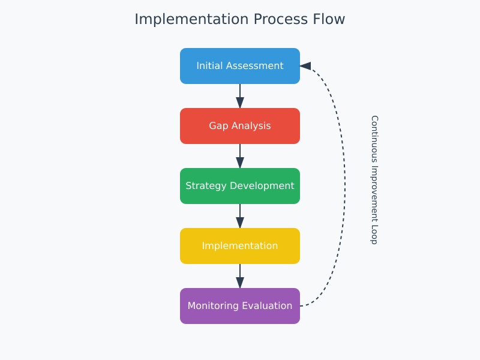

# **Appendix A: Overview and Guide to the Multi-Intelligence Optimization Assessment Frameworks**

## **1. Introduction**

In today’s complex and rapidly changing world, organizations must integrate multiple forms of intelligence to thrive. The **Multi-Intelligence Optimization Assessment Frameworks (MIOAF)** are designed to help organizations evaluate and improve their ability to leverage **human intelligence**, **artificial intelligence (AI)**, **ecological intelligence**, **collective intelligence**, **systemic intelligence**, and **external intelligence** in their decision-making and operations.

These frameworks provide a structured approach to assessing organizational performance across these dimensions, identifying gaps, and implementing actionable improvements. Whether you are a small startup, a growing mid-sized organization, or a large enterprise, the MIOAF offers a tailored solution to meet your needs.

---

## **2. Framework Tiers**

The MIOAF is divided into **three tiers**, each designed to suit organizations at different stages of maturity and resource availability:

### **Basic Tier**
- **Purpose**: For small organizations or those new to multi-intelligence optimization.
- **Focus**: Core categories include **Human Intelligence**, **AI Integration**, and **Ecological Intelligence**.
- **Scoring**: 0-60 points.
- **Ideal For**: Startups, small businesses, or organizations with limited resources.

### **Intermediate Tier**
- **Purpose**: For medium-sized organizations or those with moderate resources ready to take a more comprehensive approach.
- **Focus**: Expands on the Basic Tier by adding **Collective Intelligence**.
- **Scoring**: 0-80 points.
- **Ideal For**: Growing organizations seeking to enhance collaboration and innovation.

### **Advanced Tier**
- **Purpose**: For large, resource-rich organizations ready to fully optimize their integration of multiple forms of intelligence.
- **Focus**: Builds on the Intermediate Tier by adding **Systemic Intelligence** and **External Intelligence**.
- **Scoring**: 0-120 points.
- **Ideal For**: Large enterprises aiming for long-term resilience, strategic foresight, and industry leadership.

---

## **3. How to Choose the Right Framework**

Selecting the appropriate framework depends on your organization’s **size**, **resources**, and **goals**:

- **Basic Tier**: Choose this tier if your organization is small, new to multi-intelligence optimization, or has limited resources. It provides a simplified yet effective approach to integrating core forms of intelligence.
- **Intermediate Tier**: Opt for this tier if your organization is growing and ready to take a more comprehensive approach. It adds **Collective Intelligence** to foster collaboration and innovation.
- **Advanced Tier**: Use this tier if your organization is large, resource-rich, and aims to fully optimize its integration of all forms of intelligence. It includes **Systemic Intelligence** and **External Intelligence** for long-term resilience and strategic depth.

---

## **4. Key Principles**

The MIOAF is built on the following principles:

- **Holistic Integration**: Balancing multiple forms of intelligence to achieve optimal performance.
- **Scalability**: Frameworks designed to grow with your organization, from Basic to Advanced.
- **Action-Oriented**: Focus on translating assessment results into actionable improvements.
- **Sustainability**: Emphasizing ecological and systemic intelligence for long-term viability.
- **Adaptability**: Encouraging organizations to adapt to changing internal and external dynamics.

---

## **5. Benefits of Using the Frameworks**

By implementing the MIOAF, organizations can:

- **Improve Decision-Making**: Integrate diverse perspectives and data sources for better outcomes.
- **Enhance Innovation**: Foster creativity and collaboration across teams.
- **Promote Sustainability**: Reduce environmental impact and build regenerative systems.
- **Build Resilience**: Strengthen adaptability and long-term viability.
- **Align with External Dynamics**: Stay ahead of market trends, regulatory changes, and geopolitical risks.

---

## **6. How to Use the Appendices**

To get started with the MIOAF, follow these steps:

1. **Start with Appendix A**: Read this overview to understand the purpose, structure, and benefits of the frameworks.
2. **Choose the Right Tier**:
   - If you’re new to multi-intelligence optimization, start with **Appendix B: Basic Tier Framework**.
   - If your organization is growing and ready for a more comprehensive approach, use **Appendix C: Intermediate Tier Framework**.
   - If your organization is large and resource-rich, dive into **Appendix D: Advanced Tier Framework**.
3. **Conduct an Assessment**: Use the scoring guide and metrics in the selected appendix to evaluate your organization’s performance.
4. **Develop an Action Plan**: Identify gaps and create actionable steps to improve integration across intelligence types.
5. **Monitor Progress**: Use the implementation guidelines and measurement frequency recommendations to track progress over time.

---

## **7. Conclusion**

The **Multi-Intelligence Optimization Assessment Frameworks** provide a powerful tool for organizations to thrive in an increasingly complex world. By integrating human, AI, ecological, collective, systemic, and external intelligence, organizations can achieve exceptional performance, resilience, and innovation.

Whether you are just starting your journey or aiming for full optimization, the MIOAF offers a tailored solution to meet your needs. Begin with the **Basic Tier**, progress to the **Intermediate Tier**, and advance to the **Advanced Tier** as your organization grows and evolves.

---

## **8. Framework Visualization**

### **Intelligence Categories Relationship**
The following diagram illustrates how different forms of intelligence interact within the framework. While the Basic Tier focuses on the three core categories (Human, AI, and Ecological Intelligence), the Advanced Tier incorporates all six categories shown below:

### **Progress Tracking Dashboard**
Organizations can use a dashboard similar to the one below to monitor their progress. The metrics and categories displayed can be adjusted based on the framework tier being used:

### **Implementation Process**
Regardless of the tier chosen, the implementation process follows this cyclical pattern to ensure continuous improvement:

Note: The Basic Tier will focus on the three core intelligence categories, the Intermediate Tier adds Collective Intelligence, and the Advanced Tier includes all six categories shown in these visualizations. Organizations can use these visual tools as templates, adapting them to match their chosen framework tier.

