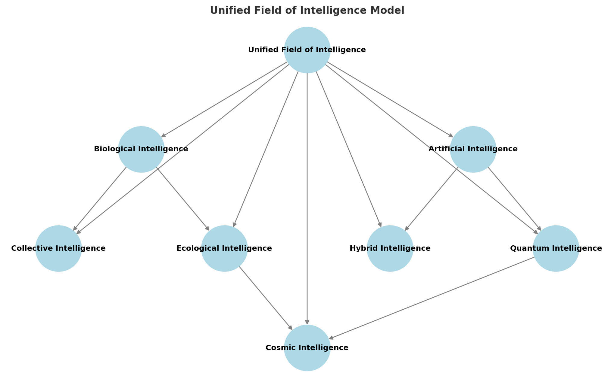

# **Chapter 2: A New Model of Intelligence & Agency**

## Rethinking Intelligence Beyond Humans
For much of history, intelligence has been narrowly defined in human terms—rationality, problem-solving, and linguistic ability have long been used as benchmarks. However, as our understanding of cognition expands, it has become evident that intelligence exists in multiple forms across biological and artificial domains. 

This chapter explores intelligence not as a linear hierarchy with humans at the top, but as a diverse and interconnected phenomenon that emerges in multiple ways across different species, ecosystems, and artificial entities.

For a deeper exploration of these ideas, see **"Understanding Infinite Intelligence: A Systems Perspective"** and **"Beyond Location: The Unified Field of Consciousness and Intelligence"** by Björn Kenneth Holmström.

## **The Unified Field of Intelligence Model**

To visualize intelligence as an interconnected system, we introduce the **Unified Field of Intelligence Model**, which depicts intelligence as a dynamic, self-organizing field that manifests in different forms across biological, artificial, and cosmic scales.

## **Key Insights from the Diagram:**
- **Field-Like Nature:** Intelligence is **not only localized** in individual entities but also emerges **through networks**.
- **Different Manifestations of Intelligence:** Intelligence appears as **biological, artificial, collective, quantum, ecological, and cosmic intelligence**, all of which interact in a larger system.

> **Real-World Implementation**
>
> The Biomimicry Institute demonstrates this integration in practice, connecting biological, human, and artificial intelligence to solve complex design challenges. By studying nature's time-tested patterns and strategies, the institute helps organizations develop sustainable solutions that combine ecological wisdom with technological innovation. Their AskNature database uses AI to help humans access and apply nature's strategies to human challenges, creating a practical bridge between different forms of intelligence.

- **Fractal & Emergent Properties:** Intelligence functions **at multiple scales**, meaning **neurons, social networks, ecosystems, and galaxies** exhibit self-organizing intelligence.
- **Feedback Loops & Evolution:** Intelligence **isn’t static**—it constantly evolves, adapts, and reorganizes itself, forming new connections and learning from its environment.

By understanding intelligence as a **unified, interconnected field**, we can move beyond traditional hierarchical models and explore a more **integrated approach to intelligence across multiple scales**.

## **What Defines Intelligence?**
Traditionally, intelligence has been measured through human-centric frameworks such as IQ, logical reasoning, and language acquisition. However, this model fails to account for the variety of intelligences that exist beyond human cognition.

Key categories of intelligence include:
- **Biological Intelligence**: The adaptive and problem-solving abilities found in humans, animals, and even plants.
- **Collective Intelligence**: The emergent intelligence found in social structures, from ant colonies to human organizations.
- **Ecological Intelligence**: The ability of ecosystems to self-regulate and maintain balance through interconnected feedback loops.
- **Artificial Intelligence**: The ability of machine systems to process data, recognize patterns, and optimize solutions beyond human capability.
- **Hybrid Intelligence**: The integration of human cognition with artificial systems, creating augmented decision-making processes.
- **Non-Localized Intelligence**: The idea that intelligence may not be confined to biological or artificial substrates but exists as a fundamental property of reality, as explored in **"Beyond Location"**.

## Expanding the Role of Non-Human Intelligence
The recognition of intelligence in non-human entities requires a paradigm shift in how we assign agency and value to different forms of cognition. Consider the following:
- **Animal Intelligence**: Studies in ethology have shown that crows use tools, dolphins have complex social communication, and octopuses exhibit problem-solving abilities that rival some mammals.
- **Plant Intelligence**: Research into plant signaling and response mechanisms suggests that plants communicate, adapt to environmental stress, and share resources through root networks and fungal symbiosis.
- **AI and Machine Intelligence**: With the rise of neural networks and machine learning, AI systems are now capable of independent learning, decision-making, and pattern recognition that surpasses human abilities in specific domains.
- **Distributed Intelligence in Ecosystems**: Systems such as coral reefs, forests, and microbial networks exhibit intelligence at a macro level, balancing their internal components in response to external stimuli.
- **Cosmic Intelligence**: Theoretical explorations suggest that intelligence may not be bound to living systems but may be an inherent aspect of the universe's structure, a theme explored in **"Understanding Infinite Intelligence"**.

## Decentralized, Self-Organizing Systems
Traditional governance and decision-making models assume a hierarchical approach, where intelligence and control are centralized in human-led institutions. However, natural systems show that decentralized intelligence can be highly effective.

Examples include:
- **Swarm Intelligence**: Ant and bee colonies function without a central authority, yet they efficiently allocate resources, adapt to environmental changes, and defend against threats.
- **Blockchain and Decentralized Networks**: The principles of decentralized computing, such as blockchain, mimic nature’s distributed problem-solving, creating trustless systems that function independently of centralized control.
- **Self-Regulating Ecosystems**: Rainforests, wetlands, and ocean currents maintain stability through intricate feedback loops without human intervention.
- **Quantum Intelligence**: Research in quantum mechanics and non-locality suggests that information exchange may occur instantaneously across distances, challenging our conventional understanding of intelligence as localized in space and time.

## **The Evolution of Intelligence and Agency**
As we acknowledge intelligence across diverse forms, we must also reconsider agency—the capacity to make decisions and influence one’s environment. Granting agency to non-human entities requires rethinking our legal, ethical, and governance models.

Key shifts include:
- **Legal Rights for Non-Human Entities**: Some nations have begun granting legal personhood to rivers, forests, and animal species, recognizing their inherent agency.
- **AI as Decision-Makers**: AI is increasingly being integrated into governance, finance, and security. How do we ensure that these systems operate with ethical considerations?
- **Inter-Species Collaboration**: From integrating AI into conservation efforts to designing urban environments that accommodate animal migration patterns, collaboration across intelligence forms is essential for long-term sustainability.
- **A Unified Field of Intelligence**: If intelligence is fundamentally **non-local**, as argued in **"Beyond Location"**, then recognizing the interconnectivity of all cognitive entities may be a crucial step toward reality optimization.

## **A Call for Intelligence Inclusivity**
The future of intelligence is not about human dominance but about **collaborative optimization**—a model where different intelligences contribute their strengths to a shared reality. Rather than asking if AI can think like humans or if animals have intelligence equivalent to us, we should ask how each intelligence **uniquely perceives, processes, and interacts with reality**.

As we move forward, **integrating multiple forms of intelligence** will be critical in solving global challenges, from climate change to economic inequality. The next chapter will introduce a structured framework for applying this **multi-intelligence model** to optimizing reality at different levels of scale.

