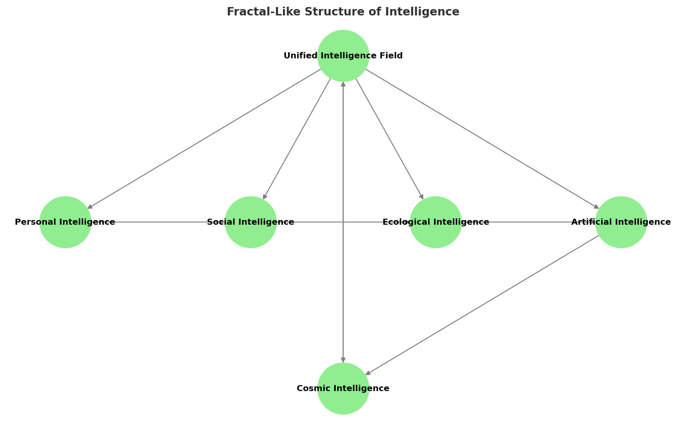

# **Chapter 3: The Five Levels of Reality Optimization**

## **From Individual to Cosmic Optimization**
To create a truly optimized reality, we must recognize that intelligence functions across multiple levels of scale. A decision that benefits an individual may have unintended consequences at the societal or ecological level. Similarly, optimizing for short-term efficiency often leads to long-term instability. 

By applying **multi-intelligence systems thinking**, we can identify five interconnected levels of reality optimization:
1. **Personal** (Self-awareness, cognition, and decision-making)
2. **Social** (Collective intelligence, governance, and cooperation)
3. **Ecological** (Ecosystem balance, planetary sustainability)
4. **Artificial** (AI alignment, machine intelligence, human-AI synergy)
5. **Cosmic** (Interstellar survival, existential evolution, universal intelligence)

Each level is **not isolated but deeply interconnected**, forming a **fractal-like optimization structure** where solutions must be **holistic and adaptive**.

## **Fractal-Like Structure of Intelligence**

The five levels of intelligence do not exist as separate entities but function as an interconnected, fractal-like system where intelligence flows dynamically between levels. The diagram below illustrates this structure, showing how intelligence emerges from a **Unified Intelligence Field** and manifests at different scales, creating an intricate web of influence, adaptation, and feedback loops.

### **Key Insights from the Diagram:**
- **Self-Similarity Across Scales:** Intelligence at one level mirrors intelligence at another. For example, the neural networks in an individual brain resemble social networks and even artificial intelligence architectures.
- **Feedback Loops:** Intelligence flows both **upward and downward**, meaning lower levels influence higher ones, and vice versa. This creates a **self-optimizing system** where improvements at one level impact the whole.
- **Interdependence:** No level can be fully optimized in isolation—**personal intelligence affects social structures, which in turn shape ecological health, AI development, and ultimately cosmic intelligence.**
- **Non-Linear Evolution:** Intelligence does not progress in a straight line but follows a **recursive and emergent** pattern, evolving based on context and interaction.

By understanding intelligence as a **fractal system**, we can apply **optimization strategies** that balance immediate human needs with planetary and cosmic-scale intelligence growth. The next sections will explore how these intelligence layers can be applied to real-world decision-making, AI governance, and sustainable ecosystem management.

## Personal Optimization: The Foundation of Intelligence
Before we can optimize external systems, we must first optimize ourselves. Personal intelligence is the **core unit** of all higher-level optimizations.

Key aspects of **personal optimization**:
- **Cognitive mastery**: Expanding mental models, critical thinking, and emotional intelligence.
- **Self-awareness & introspection**: Recognizing biases, blind spots, and optimizing one's decision-making process.
- **Flow states & peak performance**: Leveraging neurological and psychological insights to maximize creative and intellectual potential.
- **Mind-body integration**: The role of physical health, meditation, and altered states in enhancing intelligence.

By refining **internal intelligence**, individuals become **conscious nodes** within the broader intelligence network, capable of influencing **higher-order systems**.

## Social Optimization: Collective Intelligence & Governance
Once individual intelligence is optimized, it must integrate into **collective intelligence systems**. Societies function as **complex adaptive networks** where culture, governance, and economics shape human interaction.

Key aspects of **social optimization**:
- **Decentralized & participatory governance**: Moving beyond hierarchical decision-making towards self-organizing networks.
- **Cultural evolution**: Identifying patterns of social stagnation vs. collective adaptation.
- **Game theory & cooperation models**: Designing incentives for ethical and long-term collaboration.
- **Knowledge sharing & memetic engineering**: How information flows shape societal intelligence.

**Collective intelligence optimization** is essential for scaling **personal intelligence into larger functional systems** while avoiding **systemic failure modes (e.g., corruption, misinformation, polarization).**

## Ecological Optimization: Planetary Intelligence & Sustainability
Beyond human systems, reality optimization must align with **the intelligence of natural ecosystems**. Earth's biosphere is a **self-regulating entity** that has sustained life for billions of years, yet human activity has disrupted many of its natural cycles.

Key aspects of **ecological optimization**:
- **Biodiversity as intelligence**: Recognizing nature’s systems as models of adaptive complexity.
- **Regenerative vs. extractive economics**: Moving from resource exploitation to **circular and regenerative models**.
- **Planetary feedback loops**: Understanding climate systems, ecological interdependence, and how small changes create cascading effects.
- **Eco-technological synergy**: How AI, biotechnology, and sustainable energy can **integrate with natural intelligence**.

By aligning **human civilization** with **planetary intelligence**, we ensure **long-term stability** and **prevent collapse scenarios**.

> **Real-World Implementation**
>
> We can see this multi-level optimization at work in organizations like Interface Inc., which revolutionized carpet manufacturing by studying natural systems. The company integrates personal optimization (employee innovation), social optimization (stakeholder engagement), ecological optimization (zero environmental impact goal), and artificial optimization (AI-driven manufacturing efficiency). Their journey from a traditional manufacturer to a leader in sustainable business demonstrates how different levels of optimization can work together synergistically.

## Artificial Optimization: The Role of AI & Machine Intelligence
As AI systems evolve, they will play an increasing role in **reality optimization**. However, AI must be **aligned with ethical principles** and **multi-intelligence collaboration** rather than merely serving short-term efficiency goals.

Key aspects of **artificial optimization**:
- **AI alignment & value optimization**: Preventing existential risks from misaligned intelligence.
- **Human-AI collaboration**: How artificial systems can **enhance human decision-making** rather than replace it.
- **AI-driven problem solving**: The role of machine learning in solving ecological, social, and cosmic challenges.
- **Self-improving intelligence**: How AI could **contribute to the next phase of intelligence evolution**.

The question is **not whether AI will influence reality optimization**—but whether we will **ensure AI enhances rather than undermines** long-term intelligence.

## Cosmic Optimization: Intelligence Beyond Earth
The final level of reality optimization considers **intelligence on a cosmic scale**. If intelligence is a **universal emergent phenomenon**, then humanity must position itself within this greater network.

Key aspects of **cosmic optimization**:
- **Interstellar survival & expansion**: Preparing for **post-Earth civilization scenarios**.
- **Universal intelligence & interconnected systems**: Exploring theories that intelligence may be a **fundamental property of reality**.
- **Non-human intelligence & exocivilization models**: Considering the ethics of interacting with extraterrestrial intelligence.
- **The future of intelligence evolution**: How consciousness and intelligence may expand beyond biological and artificial forms.

Cosmic intelligence is the **ultimate level of optimization**, ensuring that intelligence continues evolving **beyond planetary limitations**.

## **Reality as a Self-Optimizing System**
By viewing intelligence through these **five interconnected levels**, we can begin **designing optimization frameworks** that align human decision-making with **multi-layered intelligence systems**. Rather than viewing intelligence as **individual or isolated**, we must recognize it as an **emergent, self-optimizing process** that extends from **the micro (neurons) to the macro (galaxies).**

This chapter establishes the foundation for applying **systems-level intelligence** to optimize reality as a **multi-stakeholder, adaptive process**. The following chapters will explore **practical implementations** of these models in governance, technology, and social organization.

