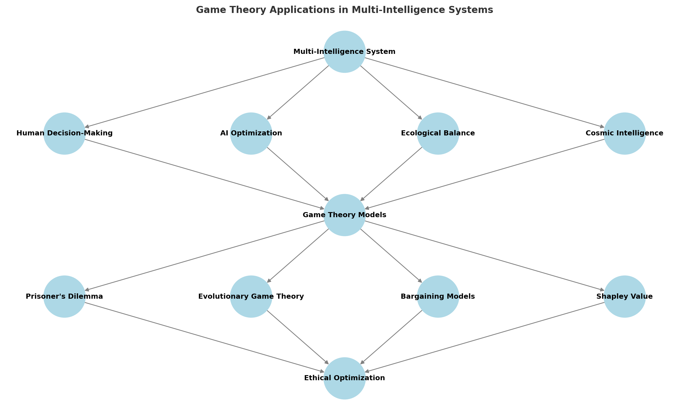

# Part 2: Multi-Agent Optimization

# **Chapter 4: Game Theory & Ethical Optimization**

## **The Strategic Nature of Optimization**
At every level of intelligence—personal, social, ecological, artificial, and cosmic—optimization involves strategic decision-making. However, optimizing for one entity or intelligence often creates **conflicts of interest** with others. Game theory provides a **mathematical and strategic framework** to analyze decision-making in multi-agent systems, helping us design optimization strategies that promote cooperation and long-term stability.

This chapter explores how **game theory** can be applied to ethical optimization, ensuring that reality is optimized in a way that benefits **all intelligences**, rather than just a select few.

## **Game Theory Applications in Multi-Intelligence Systems**
To illustrate how game theory applies to multi-intelligence decision-making, the following diagram maps the relationship between different intelligence types, strategic models, and ethical optimization outcomes.

## **Key Insights from the Diagram:**
- **Interconnected Decision-Making**: Human, AI, ecological, and cosmic intelligence **all contribute** to decision-making processes, requiring a shared strategic framework.
- **Multiple Game-Theoretic Models**: Optimization strategies vary depending on the intelligence type and context. **Prisoner’s Dilemma, Evolutionary Game Theory, Bargaining Models, and Shapley Value** each offer different pathways for cooperation and resource allocation.
- **Pathways to Ethical Optimization**: The ultimate goal of these models is to **achieve fair, sustainable, and adaptive optimization** that respects **all intelligences**.
- **Feedback Loops and Learning**: Game-theoretic approaches are **not static**; they evolve as **AI systems learn**, **humans adapt**, and **ecosystems self-regulate**, creating **continuous optimization cycles**.

> **Real-World Implementation**
>
> Conservation X Labs exemplifies this collaborative game theory approach in practice. Their open innovation platform combines AI algorithms, human expertise, and ecological data to develop conservation solutions. By creating incentive structures that reward cooperation between different stakeholders—scientists, local communities, technologists, and conservationists—they demonstrate how multi-agent systems can optimize for both environmental and social outcomes. Their successful projects, such as the DNA barcode scanner for identifying illegal wildlife products, show how aligned incentives can drive technological innovation while serving ecological preservation.

## **Game Theory Basics: Cooperation vs. Competition**
Game theory studies strategic interactions between agents, where the outcome for each participant depends on the decisions of others. The most relevant game-theoretic concepts for reality optimization include:

- **The Prisoner’s Dilemma**: A classic example of why rational actors often fail to cooperate, even when it is in their best interest.
- **The Nash Equilibrium**: A stable state where no agent benefits by unilaterally changing their decision, creating balanced but potentially suboptimal outcomes.
- **Zero-Sum vs. Non-Zero-Sum Games**: In a zero-sum game, one agent’s gain is another’s loss; in non-zero-sum scenarios, cooperation can produce mutually beneficial results.
- **Iterated Games**: Repeated interactions can encourage trust and cooperation, showing how long-term strategies differ from one-time decisions.

Game theory shows that **competition dominates in short-term interactions, but cooperation emerges over time when relationships are sustained**—a key principle for ethical optimization.

## **Expanding Game-Theoretic Models for Multi-Intelligence Systems**
Beyond the foundational models, additional frameworks can help optimize interactions between different intelligences:

### ** 1. Evolutionary Game Theory**
- Unlike traditional models, **evolutionary game theory** focuses on strategies that evolve over time through natural selection-like mechanisms.
- **Application**: Helps model how AI systems learn to cooperate, how cultural norms develop, and how ecological systems self-regulate through selection pressures.
- **Example**: How cooperation emerges in nature despite evolutionary incentives for self-interest, such as the balance between predator and prey populations.

### ** 2. Stag Hunt & Risk Dominance**
- **The Stag Hunt game** models trust and risk in cooperative efforts. If both parties cooperate, they get a high reward (hunting the stag), but if one defects, the other is left with a lower payoff (a small rabbit).
- **Application**: Helps analyze **trust-building strategies** between AI systems and humans or international agreements on sustainability.
- **Example**: Countries must decide whether to fully invest in climate change mitigation or partially defect for short-term economic gains.

### ** 3. Bargaining Models & Nash Bargaining Solution**
- **Bargaining theory** analyzes how two or more parties negotiate an optimal outcome while balancing power dynamics.
- **Application**: Used in AI-human interactions for **ethical AI deployment**, where AI negotiates trade-offs between privacy, efficiency, and fairness.
- **Example**: AI mediation in global governance, where economic powers negotiate fair resource distribution with developing nations.

### ** 4. Multi-Agent Reinforcement Learning (MARL)**
- MARL extends traditional game theory into AI systems that learn optimal strategies through simulated interactions.
- **Application**: Can be used to train AI decision-making in scenarios where **competing and cooperating agents must find equilibrium**.
- **Example**: Simulating different AI agents negotiating in **urban planning, financial markets, or ecosystem management**.

### ** 5. Shapley Value & Fairness Optimization**
- **Shapley value** is a method to fairly distribute rewards based on each participant’s contribution.
- **Application**: Ensures that **AI-driven optimizations allocate benefits equitably across all stakeholders**, including **non-human intelligences**.
- **Example**: Resource allocation models for ensuring that both human and ecological systems benefit from industrial policies.

## **The Ethics of Optimization: Balancing Stakeholder Interests**
Ethical optimization involves **ensuring fairness, sustainability, and stability** while considering the needs of different intelligences. The following strategies help avoid unethical optimization:

1. **Pareto Optimization**: A system is **Pareto efficient** when no one’s condition can be improved without making another worse. Ethical optimization seeks **Pareto improvements** that benefit multiple intelligences without exploitation.

2. **The Veil of Ignorance**: A decision-making framework where choices are made as if the decision-maker does not know their future role in the system, ensuring fairness across all perspectives.

3. **Multi-Agent Optimization**: Instead of optimizing for a single intelligence (e.g., humans or AI), we use **multi-agent reinforcement learning models** to test different optimization strategies.

4. **Tit-for-Tat Strategies**: Encouraging cooperation by reciprocating positive actions while discouraging exploitative behavior.

5. **Dynamic Optimization Models**: Since optimization goals evolve over time, ethical systems must be adaptable, updating parameters based on real-time feedback from all intelligences.

## **Applying Game Theory to Multi-Intelligence Systems**
Each form of intelligence (biological, artificial, ecological, cosmic) approaches decision-making differently. Game theory helps bridge these differences by structuring interactions **in ways that promote long-term cooperation over short-term gains**.

  **Case Studies in Ethical Optimization**:
- **Human-AI Collaboration**: How AI decision models can be designed to align with human ethics rather than profit-driven incentives.
- **Ecosystem Management**: Using **cooperative game theory** to balance conservation efforts with economic growth.
- **Interstellar Strategy**: The application of **game theory to contact scenarios with extraterrestrial intelligence**, ensuring that first contact leads to cooperation rather than conflict.

## **Game Theory as a Tool for Reality Optimization**
The central insight of game theory is that **self-interest alone does not lead to the best outcome for a system**. Instead, **cooperation, reciprocity, and adaptive intelligence** create long-term stability and optimization.

By applying game theory to **multi-intelligence decision-making**, we can ensure that ethical optimization moves beyond human-centric thinking toward a **collaborative, multi-agent model of reality optimization**.

The next chapter will explore **how AI can function as an impartial optimizer**, using its computational power to mediate between competing interests and facilitate balanced decision-making.

