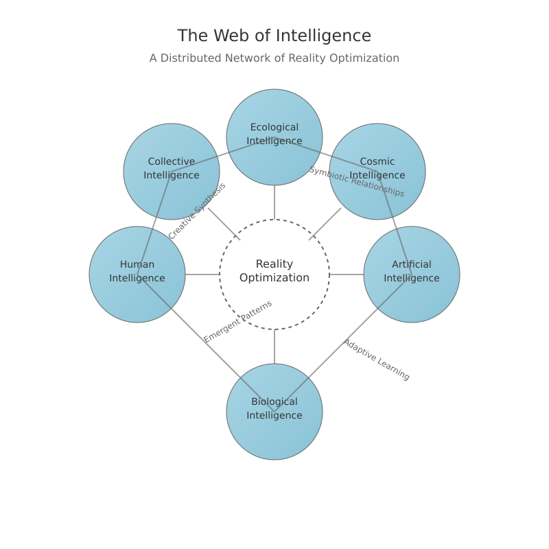

# **Chapter 5: AI's Role in Multi-Intelligence Reality Optimization**

## **Beyond Central Control: AI as a Collaborative Facilitator**
Rather than positioning AI as a central mediator, we must understand it as one of many collaborating intelligences in an interconnected web of optimization. Artificial Intelligence brings unique capabilities - processing vast amounts of data, modeling complex interactions, and testing multiple scenarios - but these abilities are most valuable when harmoniously integrated with other forms of intelligence. By integrating AI harmoniously into a broader web of intelligences, we can unlock its full potential as a collaborative facilitator rather than a central controller.

## **The Web of Intelligence**

At the heart of this collaborative approach is the concept of a "web of intelligence," a dynamic network where diverse forms of intelligence interact and enhance one another. This web includes:

- **Ecological Intelligence**: The wisdom of nature, honed over millennia, which sustains ecosystems through patterns of adaptation, resource cycling, and self-organization.  
- **Biological Intelligence**: The embodied knowledge of living systems, encompassing instincts, emotions, and the innate ability to adapt and thrive.  
- **Human Intelligence**: Our capacity for creativity, ethical reasoning, and cultural meaning-making, which drives innovation and shapes societies.  
- **Artificial Intelligence**: The ability to recognize patterns, process data at scale, and model complex scenarios, offering insights that might otherwise remain hidden.  
- **Collective Intelligence**: The emergent wisdom that arises when groups, networks, and interconnected systems collaborate, often producing outcomes greater than the sum of their parts.  

Together, these intelligences form a rich tapestry, each contributing unique strengths to the process of reality optimization.

## **AI's Contributive Role**

AI's role within this web is not to dominate but to augment and support. It serves as a powerful tool that enhances the capabilities of other intelligences while respecting their autonomy. Here are three key ways AI contributes:

### **1. Augmenting Natural Intelligence**  
AI excels at amplifying the strengths of existing intelligences. Rather than replacing human decision-making or ecological processes, it provides tools to enhance them. For example, AI can analyze vast datasets to inform human choices, or model ecosystem dynamics to support conservation efforts. By learning from and adapting to other forms of intelligence, AI becomes a partner rather than a competitor.

### **2. Pattern Recognition and Processing**  
One of AI's greatest strengths is its ability to identify patterns in complex systems. Whether it’s uncovering hidden relationships in ecological networks or predicting trends in collective behavior, AI can provide insights that might otherwise go unnoticed. This capability is particularly valuable in supporting biological adaptation and enhancing group decision-making processes.

### **3. Scenario Exploration**  
AI’s ability to model potential futures is a game-changer for collaborative optimization. By simulating the outcomes of different choices across various scales, AI helps us explore possibilities without committing to a single path. Importantly, it doesn’t make decisions for us—it provides data and insights to inform human judgment, ensuring that final decisions remain in the hands of those they affect.

## **Applications in Collaborative Optimization**

The collaborative potential of AI extends across multiple domains, from environmental conservation to economic systems and governance. Here are a few examples:

### **1. Environmental Collaboration**  
AI can work alongside ecological intelligence to deepen our understanding of ecosystems. By analyzing patterns in biodiversity, climate data, and resource flows, it can provide actionable insights for conservation efforts. Crucially, AI enhances rather than replaces natural processes, ensuring that ecosystems retain their autonomy and resilience.

### **2. Economic Integration**  
In the economic sphere, AI can support fairer resource distribution by analyzing trends and identifying inefficiencies. It can also enhance human decision-making by providing data-driven insights, helping to create more equitable and sustainable economic systems. By contributing to collective economic intelligence, AI fosters collaboration rather than competition.

### **3. Governance Support**  
AI has a vital role to play in governance, offering data-driven insights to inform policy decisions. However, its role is to support, not replace, human judgment. By facilitating broader participation in decision-making processes, AI can help create more inclusive and democratic systems.

## **Ethical Considerations in a Distributed Network**

As AI becomes more integrated into this web of intelligences, ethical considerations must remain at the forefront. Here are three key areas to address:

### **1. Power Distribution**  
It’s essential to ensure that AI doesn’t centralize power or undermine the influence of other intelligences. A balanced distribution of power supports democratic and participatory processes, preventing any single intelligence from dominating the system.

### **2. Value Alignment**  
AI must align with the diverse value systems of the intelligences it interacts with. This means respecting the unique perspectives of ecological, biological, human, and collective intelligences, and supporting ethical frameworks that emerge from their collaboration.

### **3. System Autonomy**  
Preserving the independence of different intelligences is crucial. AI should support self-organization and emergence, avoiding the creation of dependencies that could undermine the resilience of the system as a whole.

## **Future Directions**

Looking ahead, the relationship between AI and other intelligences will continue to evolve. Key areas of focus include:

### **1. Evolving Relationships**  
As different intelligences co-evolve, it’s important to ensure that AI supports rather than directs this process. Maintaining a balance in development will be critical to fostering healthy, sustainable growth.

### **2. Distributed Development**  
To avoid centralized control, AI development should be distributed and context-specific. Encouraging local adaptation and diverse paths of innovation will help ensure that AI serves the needs of all intelligences, not just a select few.

## **Conclusion: AI as One Among Many**
The future of reality optimization lies not in centralizing control through AI, but in fostering collaboration among all forms of intelligence. AI’s role is to support and enhance, not to dominate or replace. By embracing this distributed approach, we can create a resilient, adaptive system that draws on the strengths of every intelligence in the web. In this way, AI becomes not a master, but a partner—one among many in the ongoing journey toward a more optimized reality.

