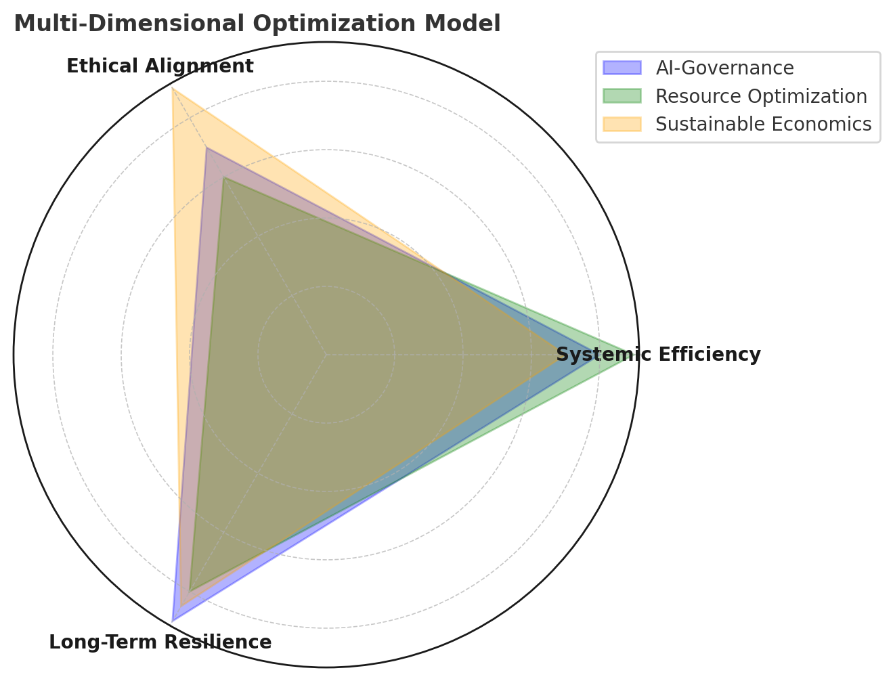

# **Chapter 6: Measuring Optimization – Efficiency vs. Ethics**

## **Beyond the Efficiency vs. Ethics Debate: A Win-Win-Win Approach**
The question of whether to prioritize efficiency or ethics in optimization is often framed as a trade-off: should we sacrifice productivity for fairness, or vice versa? However, this **binary thinking is flawed**. True optimization does not require choosing one at the expense of the other—it seeks **synergies where efficiency, ethics, and sustainability reinforce each other**.

This chapter explores how we can measure optimization **not as a zero-sum game but as a self-reinforcing system**, where well-designed ethical frameworks lead to **greater long-term efficiency** and where sustainable optimization benefits **all intelligences—human, ecological, and artificial**.

## **Multi-Dimensional Optimization Model**
To illustrate how true optimization balances **efficiency, ethics, and sustainability**, the following diagram provides a structured model where different optimization strategies are evaluated across multiple dimensions.

## **Key Insights from the Diagram:**
- **Three Core Dimensions of Optimization**:
  - **Systemic Efficiency**: Measures productivity, adaptability, and waste minimization.
  - **Ethical Alignment**: Ensures fairness, inclusivity, and sustainability.
  - **Long-Term Resilience**: Evaluates the system’s ability to remain stable and adaptive over time.
- **Optimization Strategies Vary**:
  - AI-driven governance excels in **efficiency** but requires stronger ethical safeguards.
  - Resource optimization prioritizes **efficiency**, though sustainability must be reinforced.
  - Sustainable economic models emphasize **ethics and resilience**, but efficiency improvements may still be necessary.
- **No Single Perfect Solution**: True (non-mathematical) optimization is **context-dependent** and should be **adaptive over time**.

By measuring optimization as a **multi-dimensional process** rather than a binary choice, we ensure **win-win-win solutions that benefit all intelligences and future-proof reality optimization**.

The next section will explore **how we define and apply success metrics**, ensuring that optimization models remain balanced across all three dimensions.

## **Redefining Optimization: Multi-Dimensional Success Metrics**
Traditional optimization metrics often prioritize **speed, cost-reduction, and maximum output**, but these narrow criteria frequently lead to negative unintended consequences (e.g., environmental degradation, social inequality, AI misalignment). Instead, a **multi-dimensional framework** is needed, balancing:

1. **Systemic Efficiency** – Ensuring that systems **minimize waste, maximize productivity, and enhance adaptability**.
2. **Ethical Alignment** – Optimization must **respect human rights, ecological balance, and multi-intelligence inclusivity**.
3. **Long-Term Resilience** – Sustainable models that **prevent short-term gains from creating long-term risks**.

By integrating these factors, optimization becomes a **win-win-win** situation, benefiting all stakeholders rather than forcing trade-offs.

## **Measuring Optimization: Key Metrics**

### ** 1. Adaptive Efficiency** (Beyond Productivity)
- **Resilience Over Speed**: Instead of optimizing for maximum short-term efficiency, systems should prioritize **adaptive efficiency**, which allows for **dynamic, self-correcting processes**.
- **Resource Circularity**: Rather than extract-and-waste models, optimization should focus on **regenerative cycles** where materials, energy, and labor are **reused and repurposed**.
- **Holistic Productivity**: Success is not just output per unit of time but **output that aligns with ethical and ecological stability**.

### ** 2. Ethical Impact Measurement** (Beyond Compliance)
- **AI & Human Rights Scorecards**: Evaluating whether AI decision-making respects fundamental rights.
- **Ecological Regeneration Index**: Measuring whether an optimization strategy **restores more than it consumes**.
- **Social Inclusion Metrics**: Ensuring marginalized populations benefit from optimization rather than being displaced.

### ** 3. Long-Term Systems Resilience** (Beyond Immediate Gains)
- **Scenario Stress Testing**: AI-driven simulations testing how optimization strategies perform **over decades rather than months**.
- **Biodiversity & Environmental Viability Scores**: Quantifying how well an optimization system integrates **with planetary ecosystems**.
- **Ethical Game-Theoretic Balance**: Modeling **incentive structures** where cooperation and fairness drive long-term stability.

## **Win-Win-Win Case Studies: When Efficiency, Ethics & Sustainability Align**
- **AI-Guided Conservation**: Machine learning models **enhancing agricultural yield** while **preventing habitat destruction**.
- **Post-Scarcity Economic Models**: AI-driven optimization ensuring **fair resource distribution**, reducing waste while increasing accessibility.
- **Decentralized Governance Systems**: Digital democracy tools ensuring **greater participation and fairness** without compromising decision-making speed.

## **Conclusion: The Future of Ethical Optimization**
The future of optimization is not about choosing **efficiency vs. ethics**, but about **designing systems where they enhance one another**. By integrating **adaptive efficiency, ethical impact measurement, and long-term resilience**, we can ensure that optimization benefits all intelligences.

In the next chapter, we'll explore a concrete application of these principles through the Adaptive Universal Basic Income (AUBI) system—a practical framework that demonstrates how efficiency, ethics, and resilience can be unified in real-world economic systems.

