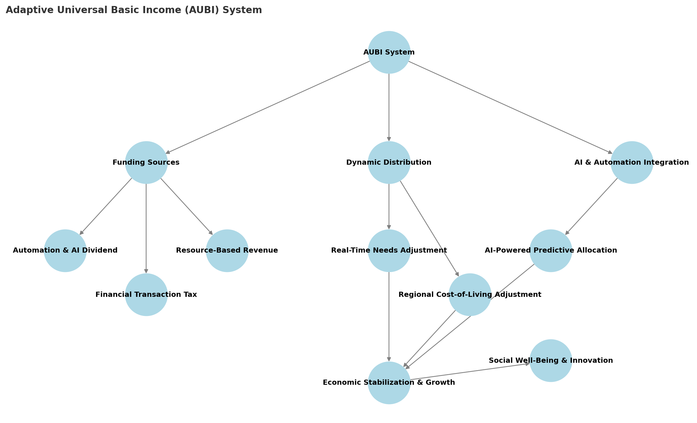

# **Chapter 7: Adaptive Universal Basic Income (AUBI) – An Economic Model for Optimization**

## **From Theory to Practice: Implementing Balanced Optimization**
Having established the importance of balancing efficiency, ethics, and long-term resilience, we now turn to a practical implementation that embodies these principles. The Adaptive Universal Basic Income (AUBI) system demonstrates how economic structures can be designed to simultaneously optimize for productivity, fairness, and sustainability.

Traditional economic systems are often inefficient in addressing **automation-driven unemployment, economic inequality, and social instability**. Welfare programs and basic income proposals exist, but they tend to be **static, bureaucratic, and slow to adapt** to evolving technological and social dynamics.

AUBI (**Adaptive Universal Basic Income**) presents a solution—an **intelligent, self-optimizing economic framework** designed to provide universal income while adapting dynamically to economic, social, and technological changes. Unlike traditional Universal Basic Income (UBI), which provides a fixed amount to all citizens, **AUBI adjusts based on real-time individual and societal factors**, ensuring that resources are distributed efficiently and fairly.

This chapter explores how AUBI **aligns economic efficiency with ethical fairness and long-term resilience**, making it a **win-win-win** solution for society, individuals, and technological progress.

## **Principles of AUBI**
AUBI is designed around three core principles:

1. **Universality** – Every person has a right to a baseline level of income, ensuring freedom from absolute poverty.
2. **Adaptivity** – The amount of income adjusts **dynamically** based on individual needs (e.g., health, contributions, regional cost-of-living, automation impact).
3. **Recognition of All Value Creation** – AUBI considers **not just traditional labor** but also **social contributions, caregiving, artistic work, innovation and contemplation/mysticism** as part of an optimized economy.

Unlike static welfare models, AUBI is a **real-time economic regulator**, designed to **balance automation, human labor, and social well-being dynamically**.

## **AUBI: Honoring Individual Sovereignty**
At its core, AUBI recognizes that each individual possesses unique forms of intelligence, creativity, and potential that may not be captured by traditional economic metrics. Unlike conventional welfare systems that often dictate how individuals should contribute to society, AUBI creates space for sovereign choice in how each person expresses their intelligence and value:

### **Freedom of Activity Choice**
- **Beyond Traditional Employment**: Recognition that valuable contributions come in many forms, from artistic creation to philosophical contemplation
- **Self-Directed Development**: Supporting individuals in following their authentic paths of growth and contribution
- **Emergence of Natural Purpose**: Creating economic conditions where individuals can discover and pursue their genuine calling

### **Expanded Value Recognition**
AUBI acknowledges various forms of societal contribution:
- **Contemplative Practices**: Meditation, philosophical inquiry, and spiritual exploration
- **Cultural Creation**: Art, music, literature, and other forms of creative expression
- **Community Care**: Family care, elder support, mentoring youth
- **Ecological Stewardship**: Environmental protection, species preservation
- **Innovation & Research**: Both formal and informal paths of discovery
- **Social Cohesion**: Community building, conflict resolution, cultural preservation

### **Supporting Individual Evolution**
Rather than prescribing specific paths, AUBI creates conditions for:
- **Natural Unfolding**: Allowing individuals to evolve at their own pace and in their own direction
- **Authentic Contribution**: Supporting people in finding ways to contribute that align with their true nature
- **Developmental Flexibility**: Accommodating changes in personal focus and direction over time

### **Practical Implementation of Sovereignty**
The system supports individual sovereignty through:
- **Minimal Bureaucracy**: Reducing paternalistic oversight and control
- **Transparent Criteria**: Clear understanding of how support levels are determined
- **Appeal Mechanisms**: Ways to address unique circumstances not captured by standard metrics
- **Privacy Protection**: Balancing data needs with personal privacy

## **Economic Self-Sustainability: How AUBI is Funded**
AUBI is designed to be financially viable without disrupting economic productivity. Its funding mechanisms are structured to **leverage automation-driven gains** while ensuring economic stability:

- **Automation & AI Dividend** – As AI and automation reduce labor demand, companies contribute a fraction of productivity gains to the AUBI pool.
- **Financial Transaction Microtax** – A minimal tax on **high-frequency trading, speculative investments, and digital transactions** provides revenue without harming the real economy.
- **Resource-Based Revenue** – Profits from **natural resource extraction, land value taxation, and green economic transitions** contribute to the system.
- **Administrative Cost Reduction** – By replacing inefficient **bureaucratic welfare programs**, AUBI significantly reduces public sector expenditure while ensuring **targeted assistance**.

AUBI doesn’t rely on a single funding source but **adapts its revenue streams** based on technological, environmental, and market conditions, ensuring financial longevity.

## **Visual Model: The Adaptive Structure of AUBI**
To illustrate the **dynamic nature of AUBI**, the following model showcases how the system adapts and optimizes in real-time.

## **Key Insights from the Diagram:**
- **Automation & AI Contributions** dynamically adjust the funding pool as technology evolves.
- **Real-Time Need Assessment** ensures that those requiring more support (due to health, caregiving roles, or regional disparities) receive an adaptive income.
- **Market Stability Mechanisms** prevent economic imbalances by adjusting payouts based on economic trends.
- **Holistic Inclusion of Value Creation** ensures that contributions **beyond traditional employment** (such as ecological restoration, education, or artistic endeavors) are economically recognized.

## **Case Studies & Simulation-Based Findings**
Empirical models and real-world case studies demonstrate that **AUBI strengthens economies** by:

- **Boosting Innovation** – People with financial security are more likely to **pursue entrepreneurship, research, and creative endeavors**.
- **Reducing Economic Inequality** – Ensuring that wealth concentration does not lead to systemic stagnation.
- **Stabilizing Automation Disruption** – Providing a safety net while allowing economies to **transition smoothly into post-scarcity models**.
- **Enhancing Mental & Physical Well-Being** – Individuals under AUBI show **lower stress levels, better health outcomes, and improved community engagement**.

These findings are supported by case studies detailed in Fjärilspartiet's (the Butterfly Party's) '**STR-204 (AUBI Case Study)**.

## **AI & AUBI: Future Synergies**
AUBI can be further optimized with **AI-driven distribution and real-time economic modeling**. AI enhances AUBI by:

- **Predicting Economic Bottlenecks** – Analyzing real-time labor and market trends to preemptively adjust AUBI payments.
- **Ensuring Fair Resource Distribution** – AI models **adjust payments based on individual and regional cost-of-living factors**.
- **Integrating Circular Economy Models** – AI monitors **waste reduction, sustainability practices, and resource management** to ensure efficient allocation.

By integrating **machine learning and decentralized financial models**, AUBI can evolve into a **self-regulating, adaptive economic infrastructure** that benefits **humans, automation, and ecological systems alike**.

## **Conclusion: AUBI as an Optimized Economic Paradigm**
AUBI is not just a **policy proposal**—it is a **model for economic optimization** that aligns efficiency, ethics, and sustainability into a single, adaptive system. It proves that **economic models do not need to sacrifice fairness for productivity** but can instead create **mutual prosperity across technological and societal domains**.

By implementing AUBI, societies can transition towards **a regenerative economy** that ensures financial stability, social well-being, and a sustainable future for all intelligences.

The next section will explore **how similar self-optimizing frameworks can be applied beyond economics** into governance, ecosystems, and interstellar intelligence management.

