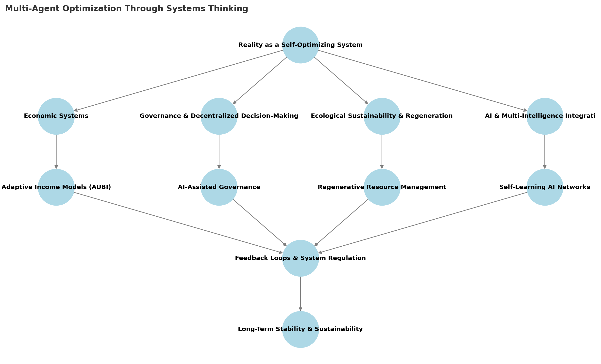

# Part 3: Systems Thinking for a Sustainable Future

# **Chapter 8: Applying Systems Thinking to Reality Optimization**

## **From Fragmented Solutions to Holistic Optimization**

The complexity of modern challenges—ranging from climate change to economic instability—requires more than isolated solutions. **Systems thinking** offers a framework to understand, predict, and optimize large-scale systems by focusing on the **interconnectedness of all elements** rather than addressing problems in isolation. This chapter explores how systems thinking can be applied to **reality optimization**, ensuring that **solutions are adaptive, self-regulating, and scalable**.

## **Visualizing Multi-Agent Optimization Through Systems Thinking**
To better understand how various domains contribute to a **self-optimizing reality**, the following diagram maps out key interactions between economic, governance, ecological, and AI-driven systems.

### **Key Insights from the Diagram:**
- **Reality as a Self-Optimizing System**: The ultimate goal is to create **systems that dynamically balance efficiency, ethics, and resilience** across various intelligence forms.
- **Four Core Domains of Optimization**:
  - **Economic Systems** → Leads to **Adaptive Income Models (AUBI)**.
  - **Governance & Decentralized Decision-Making** → Supports **AI-Assisted Governance**.
  - **Ecological Sustainability & Regeneration** → Drives **Regenerative Resource Management**.
  - **AI & Multi-Intelligence Integration** → Leads to **Self-Learning AI Networks**.
- **Feedback Loops & System Regulation**: These ensure continuous adaptation by **integrating real-time economic, political, and environmental data** into **self-improving decision frameworks**.
- **Long-Term Stability & Sustainability**: Achieved when **all systems align to continuously refine and adjust optimization strategies** without external enforcement.

By leveraging **feedback loops, adaptive decision-making, and AI-driven insights**, multi-agent systems can **continuously refine their own optimization processes**, leading to **scalable, long-term improvements across human, artificial, and ecological intelligence domains**.

The next chapter explores **how we can simulate and model these systems** to **test interventions, predict outcomes, and refine optimization strategies before real-world implementation**.

## **Core Principles of Systems Thinking Through Multiple Intelligences**

1. **Feedback Loops & Self-Regulation**
- **Ecological Intelligence**: Natural ecosystems demonstrate perfect feedback loops (predator-prey relationships, carbon cycles)
- **Human Intelligence**: Cultural and social feedback systems (traditions, customs, market responses)
- **Biological Intelligence**: Cellular and organismic self-regulation (immune systems, homeostasis)
- **Artificial Intelligence**: Data-driven feedback processing and pattern recognition
- **Collective Intelligence**: Community-based regulation and social norms

2. **Leverage Points for Maximum Impact**
- **Indigenous Knowledge**: Traditional understanding of natural cycles and intervention points
- **Ecological Wisdom**: Natural systems' efficient use of minimal resources for maximum effect
- **Social Movements**: How small groups create large-scale cultural changes
- **Technological Innovation**: Amplifying positive changes through smart intervention

3. **Fractal Scaling & Nested Systems**
 - Intelligence and optimization occur at multiple levels: **individual → societal → planetary → cosmic**.
 - Recognizing the **nested nature of systems** allows for solutions that **scale intelligently**.

4. **Distributed Adaptation & Self-Improvement**
 - The most resilient systems are **not centralized**, but instead **distributed and adaptive**.
 - AI, human societies, and ecological systems **self-improve** through continuous learning and adjustment.

## **Multi-Intelligence Participation in Systems Optimization**

Different forms of intelligence contribute unique perspectives and capabilities:

### **Natural Systems Intelligence**
- Ecosystem balance mechanisms
- Evolutionary adaptation strategies
- Biological cooperation models

### **Human Cultural Intelligence**
- Traditional ecological knowledge
- Social organization patterns
- Cultural adaptation strategies

### **Collective Intelligence**
- Community decision-making
- Social learning systems
- Cultural evolution

### **Artificial Intelligence**
- Pattern recognition
- Data processing
- Scenario modeling

### **Emergent Intelligence**
- Spontaneous organization
- Novel solution emergence
- Cross-system learning

## **Applying Systems Thinking to Multi-Agent Optimization**

- **Economic Systems**:
  - How AUBI (Chapter 7) is a **systems-based economic model**, adapting income flows dynamically.
  - Modeling economic **cycles, inflation, and resource distribution** as a **network rather than a linear equation**.

- **Governance & Decentralized Decision-Making**:
  - Using **AI-assisted governance models** that adapt based on real-time data rather than fixed laws.
  - Transitioning from **rigid, bureaucratic control** to **fluid, self-organizing policy frameworks**.

- **Ecological Sustainability & Regeneration**:
  - How **natural ecosystems self-regulate**, and what human-designed systems can learn from them.
  - Moving from **extraction-based economies** to **regenerative, cyclical resource management**.

- **AI & Multi-Intelligence Integration**:
  - Designing **AI architectures** that adapt **like living systems**, using principles from **biological intelligence**.
  - Avoiding **rigid AI objectives** and instead developing **self-correcting intelligence networks**.

## **Reality as a Multi-Intelligence Self-Optimizing System**

Optimization emerges from the interplay of multiple forms of intelligence, each contributing its unique wisdom:
- **Natural Systems** provide time-tested patterns of sustainable organization
- **Indigenous Knowledge** offers deep understanding of ecological relationships
- **Social Systems** contribute cultural adaptation strategies
- **Artificial Intelligence** supports pattern recognition and data processing
- **Individual Intelligence** brings creativity and innovation
- **Collective Intelligence** enables coordinated action

The key is not to privilege any single form of intelligence but to create conditions where all forms can contribute their wisdom to the whole.

The next chapter explores **how we can simulate and model these systems** to **test interventions, predict outcomes, and refine optimization strategies before real-world implementation**.

