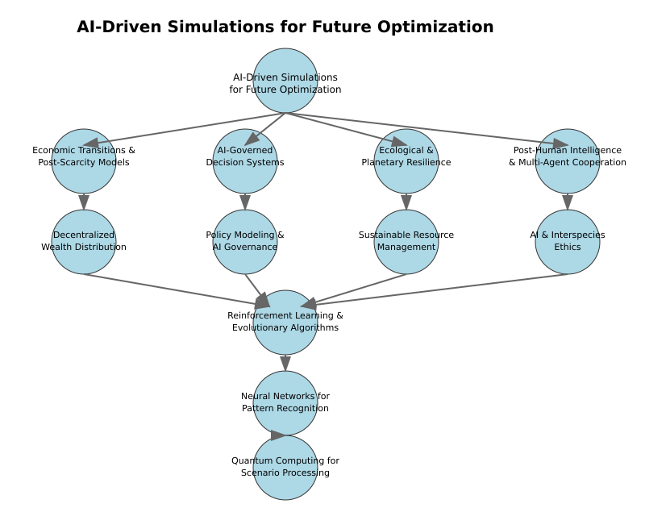

# Chapter 9: Understanding and Simulating Future Possibilities

## Beyond Computational Models: A Multi-Intelligence Approach to Future Understanding

The complexity of reality optimization requires not only computational models but also the integration of diverse ways of understanding and anticipating future possibilities. While modern AI-driven simulations offer powerful analytical tools, true wisdom about tomorrow's possibilities has existed in many forms throughout human history and indeed, throughout nature itself.

Indigenous cultures have developed sophisticated systems for understanding future possibilities through generations of careful observation and accumulated wisdom. These traditions maintain a deep understanding of how actions ripple through complex systems over time, manifesting in practices that serve the essential purpose of understanding potential futures and their implications. Through oral histories and intimate knowledge of natural cycles, these approaches often achieve what modern simulations strive for: accurate anticipation of long-term systemic effects.

Nature itself conducts the most sophisticated ongoing simulations through the process of evolution. Each ecosystem represents a living laboratory where countless parallel experiments in adaptation unfold simultaneously. These natural systems demonstrate how to explore future possibilities while maintaining stability—a crucial lesson for our own optimization efforts. The very existence of today's complex ecosystems represents the successful outcomes of billions of years of natural simulation and adaptation.

## Integrating Multiple Forms of Future Understanding

When we expand our view of simulation beyond purely computational models, we discover a rich landscape of complementary approaches:

**Traditional Ecological Knowledge** serves as a vast repository of tested scenarios and their outcomes, offering insights into long-term consequences that no computer model could yet capture. These systems encode generations of careful observation about how changes propagate through complex systems.

**Evolutionary Processes** demonstrate nature's way of running countless parallel experiments, with each adaptation representing a tested solution to complex optimization challenges. These biological simulations continue to run in real-time, offering ongoing insights into successful adaptation strategies.

**Social and Cultural Systems** have developed sophisticated methods for exploring possible futures through collective wisdom accumulation and carefully structured experimentation. Communities throughout history have engaged in forms of scenario planning that integrate multiple perspectives and types of knowledge.

## The Role of Modern Technology

Against this backdrop, modern computational capabilities take their proper place—not as replacements for existing approaches, but as powerful tools for augmenting humanity's natural capacity for future understanding. **AI-driven simulations** excel at:
- Processing vast amounts of data to identify subtle patterns
- Exploring complex scenario trees with many variables
- Testing specific interventions in detailed digital models
- Accelerating the exploration of possibility spaces

## **Why Simulate the Future?**
The complexity of reality optimization requires not only theory but also **practical modeling and testing**. Before large-scale interventions can be made in governance, economy, ecology, or AI integration, we need **simulations** that help us predict **unintended consequences, emergent behaviors, and long-term effects**. This chapter explores **how AI-driven simulations and scenario modeling** can provide valuable insights into the future of intelligence, economics, and multi-agent cooperation.

## **Key Areas of Simulation-Based Forecasting**

1. **Economic Transitions & Post-Scarcity Models**
 - How will automation and AI impact economic structures in the next 50-100 years?
 - Simulating **AUBI (Adaptive Universal Basic Income)** as a real-time economic regulator.
 - Testing new forms of **resource allocation, taxation, and decentralized wealth distribution**.

2. **AI-Governed Decision Systems**
 - Modeling AI-assisted governance frameworks and their ethical implications.
 - Simulating **policy changes, regulatory feedback loops, and social adaptation**.
 - Testing the limits of **decentralized, self-regulating governance** in different cultures and ecosystems.

3. **Ecological & Planetary Resilience**
 - How will different conservation strategies impact biodiversity and climate resilience?
 - Modeling the **long-term impact of regenerative agriculture, circular economies, and geoengineering solutions**.
 - AI-powered environmental simulations for **sustainable planetary resource management**.

4. **Post-Human Intelligence & Multi-Agent Cooperation**
 - How will human and non-human intelligences co-evolve?
 - Testing **multi-agent negotiation models** between AI, humans, and potential extraterrestrial intelligence.
 - Simulating **AI evolution, ethics, and interspecies cooperation frameworks**.

## **The Role of AI in Future Simulations**
With advancements in AI-driven modeling, **agent-based simulations** allow us to test complex multi-intelligence interactions in ways never before possible. Key AI capabilities for future forecasting include:

- **Reinforcement Learning & Evolutionary Algorithms** → Training AI models to adapt to unpredictable environments.
- **Neural Networks for Pattern Recognition** → Identifying long-term economic, ecological, and governance trends.
- **Quantum Computing for Scenario Processing** → Accelerating the testing of thousands of simultaneous future possibilities.

## **Beyond Prediction: Simulating for Active Reality Optimization**
Unlike traditional forecasting, which focuses on **passive prediction**, advanced simulations enable us to **actively refine and optimize systems in real-time**. By continuously testing, adjusting, and validating models, we move towards **self-correcting and self-optimizing global systems**.

## **Visualizing AI-Driven Simulations for Future Optimization**
To better understand how AI can assist in **future scenario modeling and decision-making**, the following diagram illustrates key simulation domains and AI-driven forecasting techniques.

### **Key Insights from the Diagram:**
- **AI-Driven Simulations as a Core Tool**: AI enables **complex scenario forecasting, policy testing, and adaptive optimization**.
- **Four Key Areas of AI Simulations**:
  - **Economic Transitions & Post-Scarcity Models** → Simulating **AUBI & decentralized wealth distribution**.
  - **AI-Governed Decision Systems** → Testing **policy adaptations, legal frameworks, and decentralized governance**.
  - **Ecological & Planetary Resilience** → AI-powered **resource sustainability, conservation efforts, and climate adaptation**.
  - **Post-Human Intelligence & Multi-Agent Cooperation** → Exploring **AI-human coexistence, ethics, and interspecies collaboration**.
- **AI Technologies Powering Simulations**:
  - **Reinforcement Learning & Evolutionary Algorithms** → AI learns by **adapting to unpredictable environments**.
  - **Neural Networks for Pattern Recognition** → AI identifies **long-term economic, ecological, and governance trends**.
  - **Quantum Computing for Scenario Processing** → AI runs **thousands of high-fidelity simulations in parallel** for deep predictive analysis.

These AI-driven simulations allow us to move beyond **passive forecasting** to **active optimization**, ensuring that governance, economic policies, and intelligence coordination evolve in response to real-world feedback.

The next chapter explores **how these self-improving frameworks can be implemented in governance, infrastructure, and planetary-scale intelligence coordination**.

