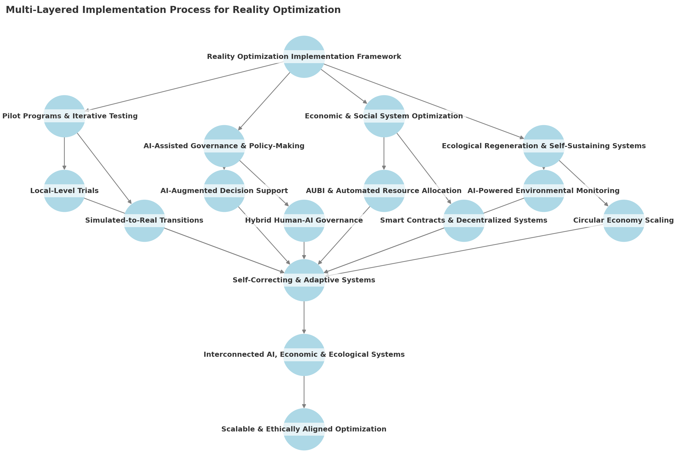

# Part 4: Implementing a Post-Anthropocentric Worldview

# **Chapter 10: From Theory to Practice – Implementing a Reality Optimization Framework**

## **Bridging Simulation and Real-World Implementation**
With AI-driven simulations offering insights into future scenarios, the next step is **applying these insights to real-world governance, economic systems, and ecological management**. This chapter outlines practical methods for turning **theory into action**, ensuring that optimization strategies are **scalable, ethical, and self-regulating**.

## **Key Challenges in Implementing Reality Optimization**
Despite technological advancements, several challenges remain:

- **Scalability** – Ensuring that optimization strategies work at **local, national, and global scales**.
- **Stakeholder Buy-In** – Gaining trust from **governments, corporations, and the public** to adopt AI-assisted governance.
- **Regulatory Barriers** – Addressing **legal and ethical concerns** surrounding AI-driven decision-making.
- **Interoperability** – Creating **systems that integrate human, AI, and ecological intelligence seamlessly**.

## **Designing a Multi-Layered Implementation Approach**
A structured approach ensures smooth adoption and adaptability:

### ** 1. Pilot Programs & Iterative Testing**
- **Local-Level Trials**: Start with small-scale implementations (e.g., **regional AUBI trials, AI-driven urban planning**).
- **Simulated-to-Real Transitions**: Run **controlled AI-driven experiments** before wide deployment.
- **Feedback & Iteration**: Continuous monitoring ensures **adaptive improvement**.

### ** 2. AI-Assisted Governance & Policy-Making**
- **AI-Augmented Decision Support**: Governments use AI to **analyze policy impact before enactment**.
- **Ethical AI Oversight**: Ensuring that AI remains **transparent and accountable**.
- **Hybrid Human-AI Governance Models**: Blending **human intuition with AI-driven insights**.

### ** 3. Economic and Social System Optimization**
- **AUBI Implementation**: Scaling **adaptive universal basic income** (from Chapter 7) into full-scale economic frameworks.
- **Automated Resource Allocation**: AI-managed **supply chains, sustainability efforts, and regenerative economies**.
- **Smart Contracts & Decentralized Economic Systems**: Using blockchain and AI for **trustless, self-regulating financial systems**.

### ** 4. Ecological Regeneration & Self-Sustaining Systems**
- **AI-Powered Environmental Monitoring**: Continuous analysis of **climate shifts, biodiversity trends, and planetary health**.
- **Automated Conservation Strategies**: AI-advised **land use planning, reforestation, and resource distribution**.
- **Circular Economy Scaling**: Ensuring that all materials and energy cycles are **closed-loop and sustainable**.

## **Building a Long-Term Adaptive Framework**
For reality optimization to be effective, it must be:
- **Self-Correcting** – Able to adapt to **new intelligence inputs** and unforeseen challenges.
- **Interconnected** – Seamlessly **integrate AI, economic, and ecological feedback loops**.
- **Scalable** – Expandable **from local initiatives to planetary-scale optimizations**.
- **Ethically Aligned** – Adhering to frameworks ensuring **long-term societal and environmental well-being**.

## The Untapped Potential of Mathematical Optimization

At its core, mathematical optimization is the science of making the best possible choice among a set of available alternatives. It provides rigorous methods for finding optimal solutions to problems that involve maximizing or minimizing specific objectives while satisfying given constraints. Whether it's minimizing costs, maximizing efficiency, or finding the perfect balance between competing goals, mathematical optimization offers powerful tools for making informed decisions.

For example, consider a reforestation project with limited resources. Mathematical optimization can help determine the optimal mix of tree species, planting locations, and timing to maximize carbon sequestration, biodiversity, and long-term forest health while staying within budget constraints. Each variable and constraint is expressed mathematically, allowing systematic exploration of possibilities to find the truly optimal solution.

While artificial intelligence has captured public attention, traditional mathematical optimization techniques remain surprisingly underutilized despite their proven ability to solve complex real-world problems efficiently and reliably. For a comprehensive introduction to mathematical optimization methods, types of problems they can solve, and practical implementation guides, see Appendix F: Mathematical Optimization - A Practical Guide.

> **Real-World Implementation**
>
> The Dutch city of Rotterdam's climate adaptation strategy employs mathematical optimization to balance multiple competing factors: flood protection, urban development, biodiversity, and budget constraints. By using advanced optimization algorithms, the city has achieved a 30% reduction in flood risks while simultaneously improving urban livability and biodiversity.

Mathematical optimization offers several unique advantages in implementing multi-intelligence frameworks:

1. **Transparency and Reliability**: Unlike "black box" AI systems, mathematical optimization provides clear, reproducible results based on well-defined objectives and constraints.

2. **Resource Efficiency**: Optimization algorithms can find the best possible solutions within given constraints, often revealing possibilities that human intuition might miss.

3. **Scalability**: From personal finance to global climate strategies, optimization techniques can be applied at any scale.

4. **Integration Capability**: Modern optimization tools can work alongside AI systems, combining the strengths of both approaches.

Despite these advantages, many organizations and institutions fail to leverage mathematical optimization effectively. Common barriers include:

- Limited awareness of optimization possibilities
- Perceived complexity of implementation
- Lack of accessible tools for non-experts
- Focus on AI solutions even when optimization might be more appropriate

The path forward requires democratizing access to optimization tools and knowledge. Projects like MOWED (Mathematical Optimization With End-user Devices) demonstrate how optimization can be made accessible to diverse users, from individuals managing personal finances to organizations planning reforestation efforts.

> **Real-World Implementation**
>
> Conservation X Labs uses mathematical optimization in their DNA barcode scanner project, optimizing both the technical aspects (scanning accuracy, processing speed) and practical implementation (cost, ease of use). This mathematical approach helped them achieve 95% accuracy in species identification while keeping the solution affordable and deployable in remote areas.

As we move toward more sophisticated reality optimization frameworks, mathematical optimization should be recognized as a fundamental tool in our collective toolkit—one that complements AI, human intelligence, and ecological wisdom in creating more effective solutions to complex challenges.

## Case Studies in Multi-Intelligence Optimization

The following case studies demonstrate how organizations have successfully implemented multi-intelligence optimization frameworks in practice. Each example highlights different aspects of integration between human, artificial, and ecological intelligence, providing concrete insights for implementation.

### Smart Cities: Rotterdam's Climate Adaptation Strategy

The Dutch city of Rotterdam provides a compelling example of multi-intelligence optimization at an urban scale. Their approach integrates:

**Human Intelligence Integration:**
- Citizen participation in urban planning
- Local knowledge for flood management
- Community-led innovation initiatives

**Artificial Intelligence Integration:**
- AI-powered climate modeling
- Smart sensors for water management
- Predictive maintenance systems

**Ecological Intelligence Integration:**
- Green infrastructure development
- Urban biodiversity programs
- Water-sensitive urban design

**Key Outcomes:**
- 30% reduction in flood risks
- 20% increase in urban biodiversity
- Significant improvement in citizen engagement
- Enhanced climate resilience

### Conservation X Labs: Technology for Biodiversity

Conservation X Labs demonstrates the power of combining multiple forms of intelligence for environmental protection:

**Human Intelligence Integration:**
- Expert knowledge networks
- Local community engagement
- Citizen science initiatives

**Artificial Intelligence Integration:**
- Machine learning for species identification
- Automated monitoring systems
- Predictive modeling for conservation

**Ecological Intelligence Integration:**
- Ecosystem-based approaches
- Natural system monitoring
- Biodiversity preservation strategies

**Key Outcomes:**
- Development of DNA barcoding technology
- Successful detection of illegal wildlife trade
- Enhanced conservation effectiveness
- Improved stakeholder collaboration

### Patagonia: Business Reimagined

Patagonia's approach to business demonstrates how commercial success can align with ecological and social responsibility:

**Human Intelligence Integration:**
- Employee-driven innovation
- Stakeholder engagement
- Fair labor practices

**Artificial Intelligence Integration:**
- Supply chain optimization
- Material science research
- Impact assessment tools

**Ecological Intelligence Integration:**
- Circular design principles
- Environmental impact reduction
- Regenerative agriculture support

**Key Outcomes:**
- Significant reduction in environmental impact
- Strong financial performance
- High employee satisfaction
- Industry leadership in sustainability

### Implementation Insights

From these case studies, several key implementation principles emerge:

1. **Start with Clear Intent**
   - Define specific optimization goals
   - Align stakeholder expectations
   - Create measurable objectives

2. **Build Integrated Systems**
   - Ensure different forms of intelligence can interact
   - Create feedback loops
   - Maintain flexibility for adaptation

3. **Measure and Adapt**
   - Track meaningful metrics
   - Gather stakeholder feedback
   - Adjust strategies based on results

4. **Foster Collaboration**
   - Create platforms for knowledge sharing
   - Encourage cross-functional teams
   - Build external partnerships

For more detailed case studies and extended examples, see Appendix E: Extended Case Studies in Multi-Intelligence Optimization.

## **Visualizing the Multi-Layered Implementation Process**
To illustrate the structured, adaptive approach required for reality optimization, the following diagram presents the key phases of implementation.

### **Key Insights from the Diagram:**
- **Reality Optimization Implementation Framework**: A structured method for deploying **AI-driven decision-making, governance models, and economic optimizations**.
- **Four Key Implementation Layers**:
  - **Pilot Programs & Iterative Testing** → Small-scale experiments to test feasibility and adaptability.
  - **AI-Assisted Governance & Policy-Making** → Integration of **human-AI decision systems** for ethical and responsive governance.
  - **Economic & Social System Optimization** → Scaling **AUBI, automated wealth distribution, and decentralized financial systems**.
  - **Ecological Regeneration & Self-Sustaining Systems** → AI-driven conservation, circular economy scaling, and planetary resource management.
- **Self-Correcting & Adaptive Systems**: Ensuring that all frameworks continuously adjust based on **real-time feedback loops**.
- **Scalable & Ethically Aligned Optimization**: The final outcome where **all interconnected systems evolve towards sustainability and resilience**.

By **integrating adaptive AI governance, dynamic economic policies, and self-improving ecological systems**, this framework ensures that **reality optimization remains a living, evolving process**. Yet, as we develop these implementation strategies, deeper questions emerge: What happens when our systems become so advanced that they begin to transcend their original structures? What lies beyond the frameworks we're creating?

As our optimization systems grow increasingly sophisticated and self-regulating, we may need to consider not just how to implement them, but how they might evolve beyond our current understanding. The next chapter explores this territory, examining **how intelligence itself evolves as we integrate AI, human cognition, and multi-species cooperation into a shared optimization framework** - and what might lie beyond even these integrated systems.

## Moving from Vision to Action

As we conclude this exploration of implementation frameworks, it becomes clear that the journey from theory to practice requires both vision and concrete methods. While the principles outlined in this chapter provide the philosophical foundation, the actual work of transformation might demand practical tools for assessment and iterative improvement.

For organizations, communities, and individuals ready to begin this journey, we have developed comprehensive assessment frameworks, detailed in appendices A,B,C and D. These frameworks provides specific tools for measuring progress across multiple dimensions of intelligence integration, from human-AI collaboration to ecological impact assessment. Like reality itself, these tools are meant to be adaptive and open to refinement as our understanding deepens.

As we move forward to explore the future of intelligence and co-existence in the next chapter, remember that each practical step we take informs our theoretical understanding, just as our expanding vision guides our concrete actions. The tools provided in the appendix offer a structured starting point for engaging with the profound transformations discussed throughout this book.
