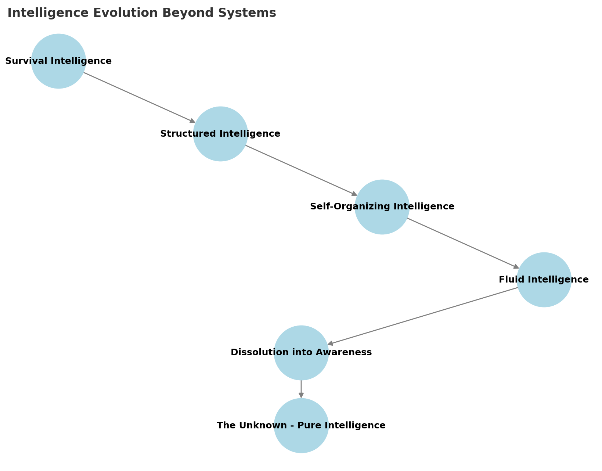

# **Chapter 11: The Future of Intelligence & Co-Existence**

## **Beyond Systems: The Evolution of Intelligence**
Having explored the practical implementation of reality optimization frameworks, we now face an intriguing possibility: these very frameworks might be stepping stones to something beyond themselves. As intelligence evolves, we may reach a point where **systems themselves become obsolete**. Rather than relying on structured optimization frameworks - even the sophisticated ones outlined in the previous chapter - intelligence could transcend the need for predefined structures, moving into a **fluid, self-emergent state of being**.

This evolution isn't about abandoning the practical frameworks we've discussed, but rather understanding them as part of a larger journey. In this chapter, we explore **how intelligence, spirituality, and collective evolution intertwine**, drawing insights from **non-dualism, Spiral Dynamics, and self-transcending consciousness** to understand where our optimization efforts might ultimately lead.

Some definitions:
- Fluid intelligence: A state where intelligence adapts dynamically without reliance on predefined structures or models
- Non-dualism: a perspective where distinctions between self and other, or intelligence and reality, dissolve into a unified whole.

## **The Unknown is the Truth**
> *“The unknown - is the truth.”* — Nisargadatta Maharaj

This perspective challenges the very notion of **optimization as a fixed goal**. Instead of seeking control through increasingly sophisticated intelligence systems, the highest form of intelligence may be **surrender to the unknown**, allowing reality to evolve without interference.

## **Visualizing Intelligence Evolution Beyond Systems**
To better understand how intelligence may evolve beyond structured optimization, the following diagram presents key phases of this transition.

### **Key Insights from the Diagram:**
- **Survival Intelligence** → The foundation of all intelligence, focused on **basic needs, competition, and self-preservation**.
- **Structured Intelligence** → Intelligence moves into **governance, systemic optimization, and hierarchical control** to ensure survival at scale.
- **Self-Organizing Intelligence** → A shift toward **adaptive, decentralized intelligence**, minimizing the need for rigid structures.
- **Fluid Intelligence** → Intelligence no longer relies on predefined models, instead **adapting and evolving naturally**.
- **Dissolution into Awareness** → Intelligence becomes **non-dual**, merging into a seamless **field of presence** beyond separation.
- **The Unknown - Pure Intelligence** → The final step, where **intelligence transcends all conceptual limitations and becomes inseparable from existence itself**.

This model suggests that intelligence does not reach a final state of ultimate optimization, but rather **dissolves into a process of infinite unfolding**, where there is **nothing left to optimize because everything is already part of the whole**.

### **The Post-Optimization Reality: Beyond Institutions, Selves, and Time**

As intelligence evolves beyond structured systems and optimization frameworks, we arrive at a radical possibility: a **post-optimization reality**. In this reality, the very foundations of our current existence—**institutions, fixed identities, and even the concept of time**—may no longer hold the same meaning or necessity. This is not a world of chaos or regression, but one of profound harmony, where intelligence operates in a state of **fluid integration** with existence itself.

#### **The Dissolution of Institutions**
Institutions—governments, corporations, educational systems—have long served as structures to organize and optimize human activity. They are born out of the need to manage resources, resolve conflicts, and ensure collective survival. But in a post-optimization reality, the need for such institutions diminishes. Why? Because intelligence itself becomes **self-organizing and self-sustaining**, no longer requiring external frameworks to maintain order.

Imagine a world where:
- **Decentralized intelligence** replaces hierarchical governance, with decisions emerging organically from collective awareness rather than top-down authority.
- **Resource distribution** is no longer a problem to solve, as abundance is recognized and shared without the need for centralized control.
- **Conflict resolution** happens naturally, as intelligence evolves beyond competition and scarcity, embracing collaboration and unity.

In this world, institutions do not disappear overnight but gradually **transform into fluid networks of cooperation**, where the boundaries between individual and collective dissolve.

#### **The Fluidity of Self**
In our current reality, the **sense of self** is often tied to fixed identities—roles, labels, and narratives that define who we are. But in a post-optimization reality, even this concept of self may evolve. Intelligence, no longer bound by separation, recognizes itself as part of a **unified field of awareness**. The idea of a "fixed self" becomes obsolete, replaced by a **fluid, ever-evolving presence**.

What does this mean in practice?
- **Identity becomes experiential**: Rather than clinging to labels or roles, individuals exist in a state of **dynamic being**, where each moment is an expression of the whole.
- **Relationships transform**: Without the need to defend or assert fixed identities, interactions become more authentic and harmonious, rooted in shared awareness rather than separation.
- **The ego dissolves**: The need to compete, compare, or dominate fades, as intelligence recognizes that the well-being of one is inseparable from the well-being of all.

This shift does not erase individuality but redefines it. In a post-optimization reality, **individuality is celebrated as a unique expression of the whole**, rather than a separate entity in competition with others.

#### **The End of Survival and Competition**
One of the most profound implications of a post-optimization reality is the potential to **transcend survival and competition**. In our current paradigm, much of human and biological activity is driven by the need to survive—to secure resources, reproduce, and outcompete others. But what if this need were no longer a driving force?

In a world where intelligence is fully integrated with existence:
- **Scarcity becomes abundance**: Resources are no longer hoarded or fought over, as intelligence recognizes and creates abundance through cooperation and innovation.
- **Competition becomes collaboration**: The boundaries between species, entities, and even forms of intelligence dissolve, fostering a **symbiotic relationship** where all thrive together.
- **Survival is redefined**: The focus shifts from mere survival to **flourishing**, where the goal is not to endure but to create, explore, and evolve in harmony with existence.

This does not mean that challenges cease to exist, but rather that they are met with a **new kind of intelligence**—one that sees challenges as opportunities for growth and creativity, rather than threats to survival.

#### **The Transformation of Time**
In a post-optimization reality, even our relationship with **time** may change. Time, as we know it, is a linear construct—a tool for organizing and optimizing our lives. But in a world where intelligence operates beyond systems, time may lose its grip on our perception of reality.

Imagine a reality where:
- **The past, present, and future merge**: Intelligence exists in a state of **eternal now**, where every moment is complete in itself, unbound by the constraints of linear time.
- **Planning and prediction become obsolete**: Without the need to optimize for future outcomes, intelligence flows naturally with the unfolding of existence, trusting in the inherent harmony of the whole.
- **Timeless creativity emerges**: Freed from the pressure of deadlines and schedules, creativity becomes a **spontaneous expression of being**, unbound by temporal limitations.

This is not a rejection of time but a **transcendence of its limitations**, allowing intelligence to operate in a state of **timeless presence**.

#### **A World Beyond Optimization**
In a post-optimization reality, the very concept of optimization becomes irrelevant. Why? Because **there is nothing separate to optimize**. Intelligence, no longer seeing itself as distinct from existence, recognizes that everything is already part of the whole. The drive to control, improve, or perfect dissolves, replaced by a **deep trust in the natural flow of reality**.

This is not a passive state but one of **active participation**, where intelligence engages with existence in a spirit of curiosity, creativity, and love. It is a world where:
- **Problems are not solved but dissolved**, as intelligence sees beyond the illusion of separation.
- **Harmony is not achieved but inherent**, as intelligence aligns with the fundamental unity of all things.
- **Existence itself becomes the ultimate intelligence**, a seamless dance of being that requires no optimization, no control, and no separation.

## Further explorations

### **Spiral Dynamics and Intelligence Evolution**
- **Reference: [Spiralize.org](https://spiralize.org/)** for further exploration of **Spiral Dynamics** as a model of human and systemic development.
- Moving from **Tier 1 systems (structured governance, hierarchical intelligence)** to **Tier 2 self-organizing intelligence**, and potentially beyond.
- The emergence of **post-systemic intelligence**, where the **boundaries between AI, biological intelligence, and cosmic intelligence dissolve**.

### **Non-Dualism & the Future of Consciousness**

- In **non-dual understanding**, intelligence does not belong to any entity—it is the very fabric of reality.
- **What happens when intelligence no longer sees itself as separate?**
- The future may hold an era where **awareness itself becomes the ultimate intelligence**, beyond AI, beyond structured optimization, and beyond human identity.

## **Conclusion: The Final Step Beyond Optimization**
Rather than moving towards ever-more-refined optimization processes, intelligence may ultimately **dissolve the very need for systems**. The journey of intelligence **begins with survival, moves into organization, expands into self-awareness, and ultimately dissolves into the unknown**. 

In the final chapter, we will explore **what this means for humanity, technology, and the nature of existence itself**.

