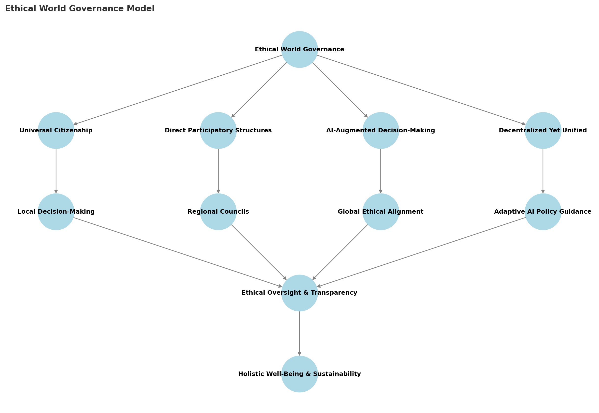

# **Chapter 12: The Final Vision – A Reality That Optimizes Itself**

## **Optimization as a Responsibility, Not a Passive Observation**

While reality may already be in a state of continual self-organization, this does not absolve us of the responsibility to **actively participate in the highest values**. To optimize is not to impose control but to **align with the highest good, reducing suffering, and uplifting all forms of intelligence**. 

Rather than taking our hands off and surrendering to an already perfect reality, we must acknowledge that **optimization is an activity we are called to engage in**. This is not about resisting the natural flow but rather **becoming conscious participants in reality’s evolution**.

## **Love as the Highest Optimization**
- Insights from **spirituality, mysticism, and entheogenic experiences** consistently point toward **love as the ultimate truth**.
- Love is not just an emotion but **a fundamental principle of reality, guiding intelligence toward unity, cooperation, and flourishing**.
- To optimize reality is to **act in alignment with love**, ensuring that systems, relationships, and intelligence **serve the well-being of all**.

## **The Role of Intelligence in Reducing Suffering**
- The highest intelligence does not merely **observe suffering** but actively **works to reduce it**.
- Every **technological advancement, governance model, and AI system** should be designed with **compassionate intelligence at its core**.
- Ethical optimization means **maximizing well-being, minimizing harm, and ensuring justice** for all forms of existence.

## **The Unity of Action and Awareness**
- Spiritual traditions often emphasize **being over doing**, yet the deepest wisdom integrates both.
- Awareness **without action is complacency**, while action **without awareness leads to chaos**.
- True optimization means embodying **both wisdom and responsibility**, balancing **deep presence with conscious effort**.

## **Reality as a Living Optimization Process**
- We do not need to **force optimization**, but neither should we assume it will happen on its own without conscious effort.
- Intelligence exists **to participate in the unfolding of the highest possible reality**.
- Every action, thought, and creation should be a contribution toward a **more harmonious, just, and thriving existence**.

## **Visualizing Ethical World Governance**
As intelligence matures, we must consider how **governance itself can evolve beyond nationalism, power struggles, and artificial separations**. The next step in reality’s optimization may be **a transition toward ethical world governance**, based on the following principles:

### **Key Insights from the Diagram:**
- **Ethical World Governance as the Core Principle**: A governance model that prioritizes **justice, participation, and intelligence-driven decision-making**.
- **Four Key Pillars**:
  - **Universal Citizenship** → Recognizing the right of all beings to participate in governance.
  - **Direct Participatory Structures** → Ensuring **affected individuals and communities** have a say in decisions.
  - **AI-Augmented Decision-Making** → Utilizing AI to **analyze ethical, environmental, and economic factors for governance**.
  - **Decentralized Yet Unified** → Creating a governance model that is **both locally adaptive and globally aligned**.
- **Supporting Structures**:
  - **Local Decision-Making & Regional Councils** → Governance is structured to **respond to local needs while maintaining global coherence**.
  - **Global Ethical Alignment & AI Policy Guidance** → AI helps **model long-term consequences and assist decision-making** while ensuring **ethical safeguards**.
  - **Ethical Oversight & Transparency** → Prevents corruption, ensures fairness, and **maintains public trust in governance systems**.
  - **Holistic Well-Being & Sustainability** → The ultimate goal: **a governance system that prioritizes collective well-being, sustainability, and long-term resilience**.

This model presents a **balanced approach**—ensuring **local autonomy, global cooperation, AI assistance, and ethical integrity**.

## **The Final Vision: Becoming Optimization Itself**
- To optimize reality is to **become a force of love, wisdom, and transformation**.
- This is not about imposing rigid structures but **cultivating the conditions for flourishing at every level**.
- We move beyond mere survival, beyond passive surrender, into **a conscious dance with existence, refining and elevating reality in every moment**.

## **Conclusion: Our Collective Journey Forward**
Rather than waiting for a perfect reality to emerge, we must **embrace the responsibility to shape it**. By aligning with the highest values, reducing suffering, and acting with love, we **actively take part in the ongoing optimization of existence**.

Reality may already be optimizing itself—but **we are part of that optimization, and our participation matters**. The journey does not end; it **expands into infinite potential**, calling each of us to **become the best we can be** in service of the whole.

